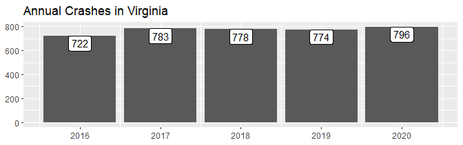

<!-- README.md is generated from README.Rmd. Please edit that file -->

# rfars

<!-- badges: start -->
<!-- badges: end -->

The goal of rfars is to simplify the process of analyzing FARS data. The
[Fatality and Injury Reporting System Tool](https://cdan.dot.gov/query)
allows users to generate queries, and can produce simple tables and
graphs. This suffices for simple analysis, but often leaves researchers
wanting more. Digging any deeper, however, involves a time-consuming
process of downloading annual ZIP files and attempting to stitch them
together - after combing through the immense data dictionary to
determine the required variables and table names. rfars allows users to
download five years of FARS data with just two lines of code. The result
is a full, rich dataset ready for mapping, modeling, and other
downstream analysis. Helper functions are also provided to produce
common counts and comparisons.

## Installation

You can install the latest version of rfars from
[GitHub](https://github.com/) with:

``` r
# install.packages("devtools")
devtools::install_github("s87jackson/rfars")
```

## Getting Data

Here we import 5 years of data for Virginia. Note that get_fars requires
your permission to download the ZIP files from NHTSA and save the
prepared files on your hard drive. This only has to be run once and
defaults to saving everything in the current working directory. The
use_fars function looks in that directory for certain files and compiles
them into one.

``` r
library(rfars)
library(dplyr)
#> 
#> Attaching package: 'dplyr'
#> The following objects are masked from 'package:stats':
#> 
#>     filter, lag
#> The following objects are masked from 'package:base':
#> 
#>     intersect, setdiff, setequal, union

# get_fars(years = 2016:2020, states="Virginia")

myFARS <- use_fars()

#head(myFARS)
```

You can review the list of variables to help guide your analysis with:

``` r
View(fars_varnames)
```

## Counts

``` r
library(ggplot2)

counts(myFARS,
       what = "crashes",
       when = 2016:2020,
       interval = c("year")
       ) %>%
  ggplot(aes(x=date, y=n, label=scales::comma(n))) + 
  geom_col() + 
    geom_label(vjust=1) +
  labs(x=NULL, y=NULL, title = "Annual Crashes in Virginia")
```



``` r
counts(myFARS,
       what = "fatalities",
       when = 2016:2020,
       interval = c("year")
       ) %>%
  ggplot(aes(x=date, y=n, label=scales::comma(n))) + 
  geom_col() + 
    geom_label(vjust=1) +
  labs(x=NULL, y=NULL, title = "Annual Fatalities in Virginia")
```


``` r
counts(myFARS,
       what = "fatalities",
       when = 2016:2020,
       where = "rural",
       interval = c("year")
       ) %>%
  ggplot(aes(x=date, y=n, label=scales::comma(n))) + 
  geom_col() + 
    geom_label(vjust=1) +
  labs(x=NULL, y=NULL, title = "Annual Rural Fatalities in Virginia")
```


Let’s compare the number of speeding-related fatalities in rural and
urban places.

``` r
bind_rows(
  counts(myFARS,
       what = "fatalities",
       when = 2016:2020,
       where = "rural",
       interval = c("year"),
       involved = "speeding"
       ) %>%
    mutate(where = "Rural"),
  counts(myFARS,
       what = "fatalities",
       when = 2016:2020,
       where = "urban",
       interval = c("year"),
       involved = "speeding"
       ) %>%
    mutate(where = "Urban")
    ) %>%
  ggplot(aes(x=date, y=n, label=scales::comma(n))) + 
    geom_col() + 
    geom_label(vjust=1) +
    facet_wrap(.~where) +
    labs(x=NULL, y=NULL, title = "Speeding-Related Fatalities in Virginia", fill=NULL)
```


## Mapping

## Modeling
