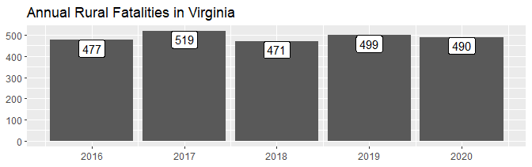

<!-- README.md is generated from README.Rmd. Please edit that file -->

# rfars 

<!-- badges: start -->

[](https://app.travis-ci.com/github/s87jackson/rfars)

<!-- badges: end -->

The goal of `rfars` is to simplify the process of analyzing FARS data.
FARS stands for [Fatality Analysis Reporting
System](https://www.nhtsa.gov/research-data/fatality-analysis-reporting-system-fars),
the census of fatal crashes in the United States maintained by the
[National Highway Traffic Safety
Administration](https://www.nhtsa.gov/). The [Fatality and Injury
Reporting System Tool](https://cdan.dot.gov/query) allows users to
generate queries, and can produce simple tables and graphs. This
suffices for simple analysis, but often leaves researchers wanting more.
Digging any deeper, however, involves a time-consuming process of
downloading annual ZIP files and attempting to stitch them together -
after first combing through the immense [data
dictionary](https://crashstats.nhtsa.dot.gov/Api/Public/ViewPublication/813254)
to determine the required variables and table names. `rfars` allows
users to download FARS data back to 2015 with just one line of code. The
result is a full, rich dataset ready for mapping, modeling, and other
downstream analysis. Helper functions are also provided to produce
common counts and comparisons.

A companion package `rfarsplus` (currently in development) will provide
exposure data and facilitate the calculation of various rates.

## Installation

You can install the latest version of `rfars` from
[GitHub](https://github.com/) with:

``` r
# install.packages("devtools")
devtools::install_github("s87jackson/rfars")
```

Then load the required packages:

## Getting and Using FARS Data

Use the `get_fars()` function to bring FARS data into the current
environment. This is done by (a) downloading the data to a temporary
directory, (b) downloading to a permanent directory, or (c) importing
from a permanent directory. After data is downloaded to a permanent
directory, the function will look there rather than downloading the data
again. If a year of data is requested but not found, R will ask your
permission to download the missing data.

Here we get three years of data for Virginia:

``` r
myFARS <- get_fars(years = 2018:2020, states = "VA")
```

This returns a ‘FARS’ object: a list with five tibbles: `flat`,
`multi_acc`, `multi_veh`, `multi_per`, and `events`.

The `flat` tibble contains all variables for which there is just one
value per crash (“accident”), vehicle, or person (e.g., weather
conditions, travel speed, age). Each row corresponds to a person
involved in a crash. As there may be multiple people and/or vehicles
involved in one crash, some variable-values are repeated within a crash
or vehicle. Each crash is uniquely identified with `id`, which is a
combination of `year` and `st_case`. Note that `st_case` is not unique
across years, for example, `st_case` 510001 will appear in each year.
The `id` variable attempts to avoid this issue.

The `multi_` tibbles contain those variables for which there may be a
varying number of values for any entity (e.g., driver impairments,
vehicle events, weather conditions at time of crash). Each tibble has
the requisite data elements corresponding to the entity: `multi_acc`
includes `st_case` and `year`, `multi_veh` adds `veh_no` (vehicle
number), and `multi_per` adds `per_no` (person number).

The `events` tibble provides a sequence of numbered events for each
vehicle in each crash.

``` r
glimpse(myFARS)
#> List of 5
#>  $ flat     : tibble [5,259 × 194] (S3: tbl_df/tbl/data.frame)
#>   ..$ year         : num [1:5259] 2018 2018 2018 2018 2018 ...
#>   ..$ state        : chr [1:5259] "Virginia" "Virginia" "Virginia" "Virginia" ...
#>   ..$ st_case      : num [1:5259] 510001 510001 510001 510002 510002 ...
#>   ..$ id           : num [1:5259] 2.02e+09 2.02e+09 2.02e+09 2.02e+09 2.02e+09 ...
#>   ..$ veh_no       : num [1:5259] 1 1 1 1 2 0 1 1 1 2 ...
#>   ..$ per_no       : num [1:5259] 1 2 3 1 1 1 1 1 2 1 ...
#>   ..$ county       : chr [1:5259] "RICHMOND (760)" "RICHMOND (760)" "RICHMOND (760)" "PITTSYLVANIA (143)" ...
#>   ..$ city         : chr [1:5259] "RICHMOND" "RICHMOND" "RICHMOND" "NOT APPLICABLE" ...
#>   ..$ lon          : num [1:5259] -77.4 -77.4 -77.4 -79.4 -79.4 ...
#>   ..$ lat          : num [1:5259] 37.6 37.6 37.6 36.7 36.7 ...
#>   ..$ ve_total     : num [1:5259] 1 1 1 2 2 1 1 2 2 2 ...
#>   ..$ ve_forms     : num [1:5259] 1 1 1 2 2 1 1 2 2 2 ...
#>   ..$ pvh_invl     : num [1:5259] 0 0 0 0 0 0 0 0 0 0 ...
#>   ..$ peds         : num [1:5259] 0 0 0 0 0 1 1 0 0 0 ...
#>   ..$ persons      : num [1:5259] 3 3 3 2 2 1 1 3 3 3 ...
#>   ..$ permvit      : num [1:5259] 3 3 3 2 2 1 1 3 3 3 ...
#>   ..$ pernotmvit   : num [1:5259] 0 0 0 0 0 1 1 0 0 0 ...
#>   ..$ day          : num [1:5259] 1 1 1 3 3 3 3 2 2 2 ...
#>   ..$ month        : chr [1:5259] "January" "January" "January" "January" ...
#>   ..$ day_week     : chr [1:5259] "Monday" "Monday" "Monday" "Wednesday" ...
#>   ..$ hour         : num [1:5259] 16 16 16 7 7 20 20 12 12 12 ...
#>   ..$ minute       : num [1:5259] 15 15 15 30 30 34 34 10 10 10 ...
#>   ..$ nhs          : chr [1:5259] "This section IS NOT on the NHS" "This section IS NOT on the NHS" "This section IS NOT on the NHS" "This section IS NOT on the NHS" ...
#>   ..$ route        : chr [1:5259] "Local Street - Municipality" "Local Street - Municipality" "Local Street - Municipality" "State Highway" ...
#>   ..$ tway_id      : chr [1:5259] "VA-127" "VA-127" "VA-127" "SR-41 FRANKLIN TRPK" ...
#>   ..$ tway_id2     : chr [1:5259] NA NA NA "GOLF CLUB RD" ...
#>   ..$ rur_urb      : chr [1:5259] "Urban" "Urban" "Urban" "Rural" ...
#>   ..$ func_sys     : chr [1:5259] "Major Collector" "Major Collector" "Major Collector" "Minor Arterial" ...
#>   ..$ rd_owner     : chr [1:5259] "City or Municipal Highway Agency" "City or Municipal Highway Agency" "City or Municipal Highway Agency" "State Highway Agency" ...
#>   ..$ milept       : chr [1:5259] "11" "11" "11" "35" ...
#>   ..$ sp_jur       : chr [1:5259] "No Special Jurisdiction" "No Special Jurisdiction" "No Special Jurisdiction" "No Special Jurisdiction" ...
#>   ..$ harm_ev      : chr [1:5259] "Tree (Standing Only)" "Tree (Standing Only)" "Tree (Standing Only)" "Motor Vehicle In-Transport" ...
#>   ..$ man_coll     : chr [1:5259] "Not a Collision with Motor Vehicle In-Transport" "Not a Collision with Motor Vehicle In-Transport" "Not a Collision with Motor Vehicle In-Transport" "Front-to-Front" ...
#>   ..$ reljct1      : chr [1:5259] "No" "No" "No" "No" ...
#>   ..$ reljct2      : chr [1:5259] "Non-Junction" "Non-Junction" "Non-Junction" "Intersection-Related" ...
#>   ..$ typ_int      : chr [1:5259] "Not an Intersection" "Not an Intersection" "Not an Intersection" "T-Intersection" ...
#>   ..$ wrk_zone     : chr [1:5259] "None" "None" "None" "None" ...
#>   ..$ rel_road     : chr [1:5259] "On Roadside" "On Roadside" "On Roadside" "On Roadway" ...
#>   ..$ lgt_cond     : chr [1:5259] "Daylight" "Daylight" "Daylight" "Daylight" ...
#>   ..$ sch_bus      : chr [1:5259] "No" "No" "No" "No" ...
#>   ..$ rail         : chr [1:5259] "Not Applicable" "Not Applicable" "Not Applicable" "Not Applicable" ...
#>   ..$ not_hour     : num [1:5259] 99 99 99 99 99 99 99 99 99 99 ...
#>   ..$ not_min      : num [1:5259] 99 99 99 99 99 99 99 99 99 99 ...
#>   ..$ arr_hour     : num [1:5259] 99 99 99 99 99 99 99 99 99 99 ...
#>   ..$ arr_min      : num [1:5259] 99 99 99 99 99 99 99 99 99 99 ...
#>   ..$ hosp_hr      : num [1:5259] 99 99 99 99 99 88 88 99 99 99 ...
#>   ..$ hosp_mn      : num [1:5259] 99 99 99 99 99 88 88 99 99 99 ...
#>   ..$ fatals       : num [1:5259] 1 1 1 1 1 1 1 1 1 1 ...
#>   ..$ drunk_dr     : num [1:5259] 0 0 0 0 0 0 0 0 0 0 ...
#>   ..$ str_veh      : num [1:5259] 0 0 0 0 0 1 0 0 0 0 ...
#>   ..$ age          : chr [1:5259] "23 Years" "22 Years" "19 Years" "29 Years" ...
#>   ..$ sex          : chr [1:5259] "Male" "Male" "Female" "Male" ...
#>   ..$ per_typ      : chr [1:5259] "Driver of a Motor Vehicle In-Transport" "Passenger of a Motor Vehicle In-Transport" "Passenger of a Motor Vehicle In-Transport" "Driver of a Motor Vehicle In-Transport" ...
#>   ..$ inj_sev      : chr [1:5259] "Suspected Minor Injury (B)" "Suspected Serious Injury (A)" "Fatal Injury (K)" "Suspected Serious Injury (A)" ...
#>   ..$ seat_pos     : chr [1:5259] "Front Seat, Left Side" "Second Seat, Left Side" "Front Seat, Right Side" "Front Seat, Left Side" ...
#>   ..$ rest_use     : chr [1:5259] "None Used / Not Applicable" "None Used / Not Applicable" "None Used / Not Applicable" "Shoulder and Lap Belt Used" ...
#>   ..$ rest_mis     : chr [1:5259] "No" "No" "No" "No" ...
#>   ..$ air_bag      : chr [1:5259] "Deployed- Front" "Not Deployed" "Not Deployed" "Deployed- Front" ...
#>   ..$ ejection     : chr [1:5259] "Not Ejected" "Not Ejected" "Not Ejected" "Not Ejected" ...
#>   ..$ ej_path      : chr [1:5259] "Ejection Path Not Applicable" "Ejection Path Not Applicable" "Ejection Path Not Applicable" "Ejection Path Not Applicable" ...
#>   ..$ extricat     : chr [1:5259] "Not Extricated or Not Applicable" "Not Extricated or Not Applicable" "Not Extricated or Not Applicable" "Not Extricated or Not Applicable" ...
#>   ..$ drinking     : chr [1:5259] "No (Alcohol Not Involved)" "Not Reported" "Not Reported" "No (Alcohol Not Involved)" ...
#>   ..$ alc_det      : chr [1:5259] "Not Reported" "Not Reported" "Not Reported" "Not Reported" ...
#>   ..$ alc_status   : chr [1:5259] "Test Not Given" "Test Not Given" "Test Not Given" "Test Not Given" ...
#>   ..$ atst_typ     : chr [1:5259] "Test Not Given" "Test Not Given" "Test Not Given" "Test Not Given" ...
#>   ..$ alc_res      : chr [1:5259] "Test Not Given" "Test Not Given" "Test Not Given" "Test Not Given" ...
#>   ..$ drugs        : chr [1:5259] "Reported as Unknown" "Not Reported" "Not Reported" "No (drugs not involved)" ...
#>   ..$ drug_det     : chr [1:5259] "Not Reported" "Not Reported" "Not Reported" "Not Reported" ...
#>   ..$ dstatus      : chr [1:5259] "Test Not Given" "Test Not Given" "Test Not Given" "Test Not Given" ...
#>   ..$ hospital     : chr [1:5259] "EMS Unknown Mode" "EMS Unknown Mode" "Not Transported" "EMS Unknown Mode" ...
#>   ..$ doa          : chr [1:5259] "Not Applicable" "Not Applicable" "Died at Scene" "Not Applicable" ...
#>   ..$ death_da     : chr [1:5259] "Not Applicable (Non-Fatal)" "Not Applicable (Non-Fatal)" "1" "Not Applicable (Non-Fatal)" ...
#>   ..$ death_mo     : chr [1:5259] "Not Applicable (Non-Fatal)" "Not Applicable (Non-Fatal)" "January" "Not Applicable (Non-Fatal)" ...
#>   ..$ death_yr     : chr [1:5259] "Not Applicable (Non-fatal)" "Not Applicable (Non-fatal)" "2018" "Not Applicable (Non-fatal)" ...
#>   ..$ death_hr     : num [1:5259] 88 88 16 88 8 20 88 12 88 88 ...
#>   ..$ death_mn     : num [1:5259] 88 88 20 88 45 40 88 39 88 88 ...
#>   ..$ death_tm     : chr [1:5259] "Not Applicable (Non-fatal)" "Not Applicable (Non-fatal)" "1620" "Not Applicable (Non-fatal)" ...
#>   ..$ lag_hrs      : num [1:5259] 999 999 0 999 1 0 999 0 999 999 ...
#>   ..$ lag_mins     : num [1:5259] 99 99 5 99 15 6 99 29 99 99 ...
#>   ..$ work_inj     : chr [1:5259] "Not Applicable (not a fatality)" "Not Applicable (not a fatality)" "No" "Not Applicable (not a fatality)" ...
#>   ..$ hispanic     : chr [1:5259] "Not A Fatality (not Applicable)" "Not A Fatality (not Applicable)" "Non-Hispanic" "Not A Fatality (not Applicable)" ...
#>   ..$ location     : chr [1:5259] "Occupant of a Motor Vehicle" "Occupant of a Motor Vehicle" "Occupant of a Motor Vehicle" "Occupant of a Motor Vehicle" ...
#>   ..$ numoccs      : chr [1:5259] "03" "03" "03" "01" ...
#>   ..$ unittype     : chr [1:5259] "Motor Vehicle In-Transport (Inside or Outside the Trafficway)" "Motor Vehicle In-Transport (Inside or Outside the Trafficway)" "Motor Vehicle In-Transport (Inside or Outside the Trafficway)" "Motor Vehicle In-Transport (Inside or Outside the Trafficway)" ...
#>   ..$ hit_run      : chr [1:5259] "No" "No" "No" "No" ...
#>   ..$ reg_stat     : chr [1:5259] "Virginia" "Virginia" "Virginia" "Virginia" ...
#>   ..$ owner        : chr [1:5259] "Driver (in this crash) was  Registered Owner" "Driver (in this crash) was  Registered Owner" "Driver (in this crash) was  Registered Owner" "Driver (in this crash) was  Registered Owner" ...
#>   ..$ make         : chr [1:5259] "Honda" "Honda" "Honda" "Honda" ...
#>   ..$ model        : num [1:5259] 32 32 32 32 2 NA 401 403 403 881 ...
#>   ..$ mak_mod      : chr [1:5259] "Honda Accord (Note: For Crosstour model years 2010 and 2011 only. For Crosstour model years 2012-2015, see vehi"| __truncated__ "Honda Accord (Note: For Crosstour model years 2010 and 2011 only. For Crosstour model years 2012-2015, see vehi"| __truncated__ "Honda Accord (Note: For Crosstour model years 2010 and 2011 only. For Crosstour model years 2012-2015, see vehi"| __truncated__ "Honda Accord (Note: For Crosstour model years 2010 and 2011 only. For Crosstour model years 2012-2015, see vehi"| __truncated__ ...
#>   ..$ body_typ     : chr [1:5259] "4-door sedan, hardtop" "4-door sedan, hardtop" "4-door sedan, hardtop" "4-door sedan, hardtop" ...
#>   ..$ mod_year     : chr [1:5259] "2005" "2005" "2005" "2003" ...
#>   ..$ vin          : chr [1:5259] "1HGCM66535A0" "1HGCM66535A0" "1HGCM66535A0" "1HGCM56333A0" ...
#>   ..$ tow_veh      : chr [1:5259] "No Trailing Units" "No Trailing Units" "No Trailing Units" "No Trailing Units" ...
#>   ..$ j_knife      : chr [1:5259] "Not an Articulated Vehicle" "Not an Articulated Vehicle" "Not an Articulated Vehicle" "Not an Articulated Vehicle" ...
#>   ..$ mcarr_i1     : chr [1:5259] "Not Applicable" "Not Applicable" "Not Applicable" "Not Applicable" ...
#>   ..$ mcarr_i2     : chr [1:5259] "Not Applicable" "Not Applicable" "Not Applicable" "Not Applicable" ...
#>   ..$ mcarr_id     : chr [1:5259] "Not Applicable" "Not Applicable" "Not Applicable" "Not Applicable" ...
#>   ..$ v_config     : chr [1:5259] "Not Applicable" "Not Applicable" "Not Applicable" "Not Applicable" ...
#>   .. [list output truncated]
#>  $ multi_acc:'data.frame':   4777 obs. of  5 variables:
#>   ..$ state  : chr [1:4777] "Virginia" "Virginia" "Virginia" "Virginia" ...
#>   ..$ st_case: num [1:4777] 510001 510002 510003 510004 510005 ...
#>   ..$ name   : chr [1:4777] "weather" "weather" "weather" "weather" ...
#>   ..$ value  : chr [1:4777] "Not Reported" "Not Reported" "Not Reported" "Not Reported" ...
#>   ..$ year   : num [1:4777] 2018 2018 2018 2018 2018 ...
#>  $ multi_veh:'data.frame':   47959 obs. of  6 variables:
#>   ..$ state  : chr [1:47959] "Virginia" "Virginia" "Virginia" "Virginia" ...
#>   ..$ st_case: num [1:47959] 510001 510002 510002 510003 510004 ...
#>   ..$ veh_no : num [1:47959] 1 1 2 1 1 2 1 1 1 1 ...
#>   ..$ name   : chr [1:47959] "vehiclesf" "vehiclesf" "vehiclesf" "vehiclesf" ...
#>   ..$ value  : chr [1:47959] "None" "None" "None" "None" ...
#>   ..$ year   : num [1:47959] 2018 2018 2018 2018 2018 ...
#>  $ multi_per:'data.frame':   31896 obs. of  7 variables:
#>   ..$ state  : chr [1:31896] "Virginia" "Virginia" "Virginia" "Virginia" ...
#>   ..$ st_case: num [1:31896] 510001 510001 510001 510002 510002 ...
#>   ..$ veh_no : num [1:31896] 1 1 1 1 2 0 1 1 1 2 ...
#>   ..$ per_no : num [1:31896] 1 2 3 1 1 1 1 1 2 1 ...
#>   ..$ name   : chr [1:31896] "race" "race" "race" "race" ...
#>   ..$ value  : chr [1:31896] "Not a Fatality (not Applicable)" "Not a Fatality (not Applicable)" "Black" "Not a Fatality (not Applicable)" ...
#>   ..$ year   : num [1:31896] 2018 2018 2018 2018 2018 ...
#>  $ events   :'data.frame':   8410 obs. of  7 variables:
#>   ..$ state    : chr [1:8410] "Virginia" "Virginia" "Virginia" "Virginia" ...
#>   ..$ st_case  : num [1:8410] 510001 510001 510002 510002 510002 ...
#>   ..$ veh_no   : num [1:8410] 1 1 1 1 2 1 1 2 1 1 ...
#>   ..$ veventnum: num [1:8410] 1 2 1 2 1 1 1 1 1 2 ...
#>   ..$ soe      : chr [1:8410] "Ran Off Roadway - Right" "Tree (Standing Only)" "Cross Centerline" "Motor Vehicle In-Transport" ...
#>   ..$ aoi      : chr [1:8410] "Non-Harmful Event" "1 Clock Point" "Non-Harmful Event" "12 Clock Point" ...
#>   ..$ year     : num [1:8410] 2018 2018 2018 2018 2018 ...
#>  - attr(*, "class")= chr [1:2] "list" "FARS"
```

You can review the list of variables to help guide your analysis with:

``` r
View(fars_varnames)
```

## Counts

A first step in many transportation safety analyses involves counting
the number of relevant crashes, fatalities, or people involved.
`counts()` lets users specify *what* to count, *where* to count them
(rural/urban and/or in specified states), *who* to include, which
*years* to include and an aggregation *interval* (annually or monthly),
and factors *involved* in the crash. It returns a simple tibble that can
be easily piped into `ggplot()` to quickly visualize counts.

``` r
counts(
  myFARS,
  what = "crashes",
  interval = c("year")
  ) %>%
  ggplot(aes(x=date, y=n, label=scales::comma(n))) + 
    geom_col() + 
    geom_label(vjust=1.2) +
    labs(x=NULL, y=NULL, title = "Fatal Crashes in Virginia")
```



``` r
counts(
  myFARS,
  what = "fatalities",
  interval = c("year")
  ) %>%
  ggplot(aes(x=date, y=n, label=scales::comma(n))) + 
    geom_col() + 
    geom_label(vjust=1.2) +
    labs(x=NULL, y=NULL, title = "Fatalities in Virginia")
```


``` r
counts(myFARS,
       what = "fatalities",
       where = "rural",
       interval = c("year")
       ) %>%
  ggplot(aes(x=date, y=n, label=scales::comma(n))) + 
    geom_col() + 
    geom_label(vjust=1.2) +
    labs(x=NULL, y=NULL, title = "Rural Fatalities in Virginia")
```


``` r
counts(myFARS,
       what = "fatalities",
       where = "rural",
       interval = c("year"),
       involved = "speeding"
       ) %>%
  ggplot(aes(x=date, y=n, label=scales::comma(n))) + 
    geom_col() + 
    geom_label(vjust=1.2) +
    labs(x=NULL, y=NULL, title = "Speeding-Related Fatalities in Rural Virginia")
```


We can combine two `counts()` results to make a comparison. Here we
compare the number of speeding-related fatalities in rural and urban
Virginia:

``` r
bind_rows(
  counts(myFARS,
       what = "fatalities",
       where = "rural",
       interval = c("year"),
       involved = "speeding"
       ) %>%
    mutate(where = "Rural"),
  counts(myFARS,
       what = "fatalities",
       where = "urban",
       interval = c("year"),
       involved = "speeding"
       ) %>%
    mutate(where = "Urban")
    ) %>%
  ggplot(aes(x=date, y=n, label=scales::comma(n))) + 
    geom_col() + 
    geom_label(vjust=1.2) +
    facet_wrap(.~where) +
    labs(x=NULL, y=NULL, title = "Speeding-Related Fatalities in Virginia", fill=NULL)
```


## Mapping

We can take advantage of having access to the full data with maps. Here
we map pedestrian and bicyclist fatalities in Virginia:

``` r
counts(
  myFARS, 
  what = "crashes", 
  involved = "pedbike", 
  filterOnly = TRUE
  ) %>%
leaflet() %>%
  addTiles() %>%
  addHeatmap(group = "Heatmap", radius=10, blur=20, minOpacity = .01, max = .2, cellSize = 1) %>%
  addCircleMarkers(
    radius = 1,
    color = "red",
    stroke = FALSE,
    fillOpacity = 0.7, group = "Crash Locations") 
#> Assuming "lon" and "lat" are longitude and latitude, respectively
#> Assuming "lon" and "lat" are longitude and latitude, respectively
```


Drug-related crashes:

``` r
counts(
  myFARS, 
  what = "crashes", 
  involved = "drugs", 
  filterOnly = TRUE
  ) %>%
  filter(!is.na(lat), !is.na(lon)) %>%
leaflet() %>%
  addTiles() %>%
  addHeatmap(group = "Heatmap", radius=10, blur=20, minOpacity = .01, max = .2, cellSize = 1) %>%
  addCircleMarkers(
    radius = 1,
    color = "red",
    stroke = FALSE,
    fillOpacity = 0.7, group = "Crash Locations") 
#> Assuming "lon" and "lat" are longitude and latitude, respectively
#> Assuming "lon" and "lat" are longitude and latitude, respectively
```


Young drivers:

``` r
counts(
  myFARS, 
  what = "crashes", 
  involved = "young driver", 
  filterOnly = TRUE
  ) %>%
  filter(!is.na(lat), !is.na(lon)) %>%
leaflet() %>%
  addTiles() %>%
  addHeatmap(group = "Heatmap", radius=10, blur=20, minOpacity = .01, max = .2, cellSize = 1) %>%
  addCircleMarkers(
    radius = 1,
    color = "red",
    stroke = FALSE,
    fillOpacity = 0.7, group = "Crash Locations") 
#> Note: Young drivers are defined as those between the ages of 15 and 20.
#> Warning in mask$eval_all_mutate(quo): NAs introduced by coercion
#> Assuming "lon" and "lat" are longitude and latitude, respectively
#> Assuming "lon" and "lat" are longitude and latitude, respectively
```


## Modeling

Having access to the full dataset also allows us to develop statistical
models. Here we fit a simple model of injury severity as a function of
age and restraint use. The results indicate that injury severity
increases with age, and when seat belts are not used properly.

``` r
# table(myFARS$flat$inj_sev)
# table(myFARS$flat$rest_use, useNA = "ifany")
# table(myFARS$flat$per_typ, useNA = "ifany")

model_data <-
  myFARS$flat %>%
  filter(rest_use %in% c("Lap Belt Only Used",
                         "Shoulder Belt Only Used",
                         "None Used / Not Applicable",
                         "None Used/Not Applicable",
                         "Shoulder and Lap Belt Used"),
         per_typ %in% c("Driver of a Motor Vehicle In-Transport",
                        "Passenger of a Motor Vehicle In-Transport")
         ) %>%
  mutate(
    rest_use = case_when(
      rest_use %in% c("Lap Belt Only Used", "Shoulder Belt Only Used") ~ "Partial",
      rest_use %in% c("None Used / Not Applicable", "None Used/Not Applicable") ~ "None",
      rest_use %in% c("Shoulder and Lap Belt Used") ~ "Full",
      TRUE ~ "Unknown"
      ) %>%
      as.factor() %>%
      relevel(ref = "Full"),
    kabco = case_when(
      inj_sev == "Fatal Injury (K)" ~ 4,
      inj_sev %in% c("Suspected Serious Injury (A)", 
                     "Suspected Serious Injury(A)") ~ 3,
      inj_sev %in% c("Suspected Minor Injury (B)", 
                     "Suspected Minor Injury(B)") ~ 2,
      inj_sev == "Possible Injury (C)" ~ 1,
      inj_sev == "No Apparent Injury (O)" ~ 0,
      TRUE ~ as.numeric(NA)
      ),
    age_n = gsub("\\D+","", age) %>% as.numeric()) 

my_model <- lm(kabco ~ age_n + rest_use, data = model_data) 

stargazer::stargazer(my_model, type = "html")
```

<table style="text-align:center">
<tr>
<td colspan="2" style="border-bottom: 1px solid black">
</td>
</tr>
<tr>
<td style="text-align:left">
</td>
<td>
<em>Dependent variable:</em>
</td>
</tr>
<tr>
<td>
</td>
<td colspan="1" style="border-bottom: 1px solid black">
</td>
</tr>
<tr>
<td style="text-align:left">
</td>
<td>
kabco
</td>
</tr>
<tr>
<td colspan="2" style="border-bottom: 1px solid black">
</td>
</tr>
<tr>
<td style="text-align:left">
age_n
</td>
<td>
0.009<sup>\*\*\*</sup>
</td>
</tr>
<tr>
<td style="text-align:left">
</td>
<td>
(0.001)
</td>
</tr>
<tr>
<td style="text-align:left">
</td>
<td>
</td>
</tr>
<tr>
<td style="text-align:left">
rest_useNone
</td>
<td>
1.474<sup>\*\*\*</sup>
</td>
</tr>
<tr>
<td style="text-align:left">
</td>
<td>
(0.042)
</td>
</tr>
<tr>
<td style="text-align:left">
</td>
<td>
</td>
</tr>
<tr>
<td style="text-align:left">
rest_usePartial
</td>
<td>
0.520<sup>\*\*</sup>
</td>
</tr>
<tr>
<td style="text-align:left">
</td>
<td>
(0.222)
</td>
</tr>
<tr>
<td style="text-align:left">
</td>
<td>
</td>
</tr>
<tr>
<td style="text-align:left">
Constant
</td>
<td>
1.702<sup>\*\*\*</sup>
</td>
</tr>
<tr>
<td style="text-align:left">
</td>
<td>
(0.053)
</td>
</tr>
<tr>
<td style="text-align:left">
</td>
<td>
</td>
</tr>
<tr>
<td colspan="2" style="border-bottom: 1px solid black">
</td>
</tr>
<tr>
<td style="text-align:left">
Observations
</td>
<td>
4,301
</td>
</tr>
<tr>
<td style="text-align:left">
R<sup>2</sup>
</td>
<td>
0.224
</td>
</tr>
<tr>
<td style="text-align:left">
Adjusted R<sup>2</sup>
</td>
<td>
0.224
</td>
</tr>
<tr>
<td style="text-align:left">
Residual Std. Error
</td>
<td>
1.338 (df = 4297)
</td>
</tr>
<tr>
<td style="text-align:left">
F Statistic
</td>
<td>
414.442<sup>\*\*\*</sup> (df = 3; 4297)
</td>
</tr>
<tr>
<td colspan="2" style="border-bottom: 1px solid black">
</td>
</tr>
<tr>
<td style="text-align:left">
<em>Note:</em>
</td>
<td style="text-align:right">
<sup>*</sup>p\<0.1; <sup>**</sup>p\<0.05; <sup>***</sup>p\<0.01
</td>
</tr>
</table>

``` r
new_data <- expand.grid(
  age_n = c(20, 60),
  rest_use = factor(c("Full", "Partial", "None"), levels = c("Full", "Partial", "None"), ordered = TRUE) )

new_data %>%
  mutate(pred = predict(my_model, newdata = new_data),
         age = paste0(age_n, " yrs")) %>%
  ggplot(aes(x=rest_use, y=pred)) +
    geom_col() +
    facet_wrap(.~age) +
    scale_y_continuous(
      limits = c(0,4), breaks = 0:4, labels = c("O", "C", "B", "A", "K"), expand = expansion()) +
    theme(panel.grid = element_blank(),
          panel.grid.major.y = element_line(c("black")),
          axis.ticks = element_blank()) +
    labs(x="", y="", title = "Predicted Injury Severity by Age and Restraint Use",
         caption = "Full = correctly used seatbelt, partial = partially correctly used, none = no seatbelt.")
```


