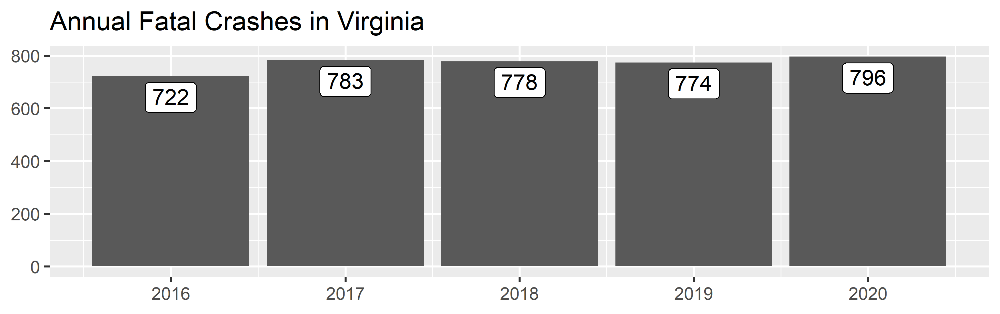
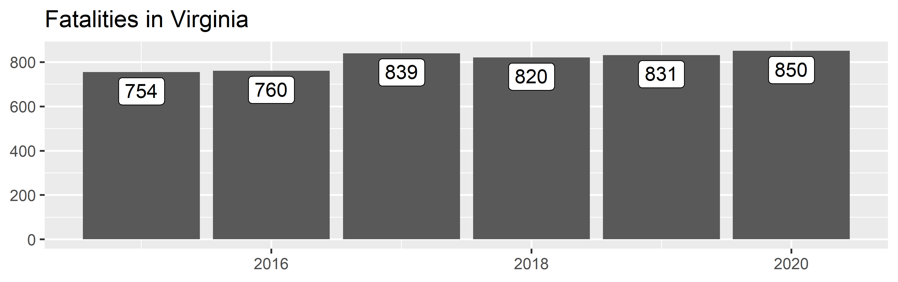
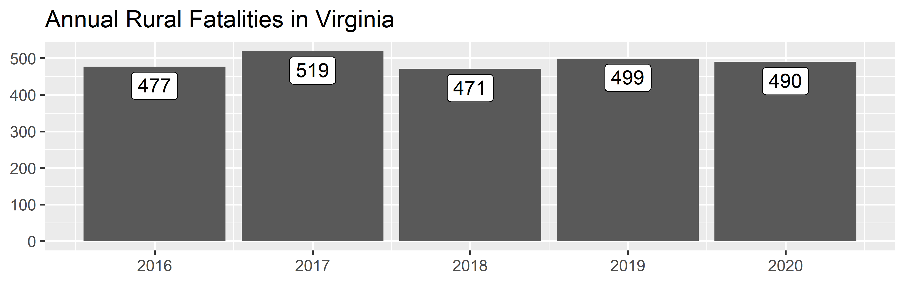
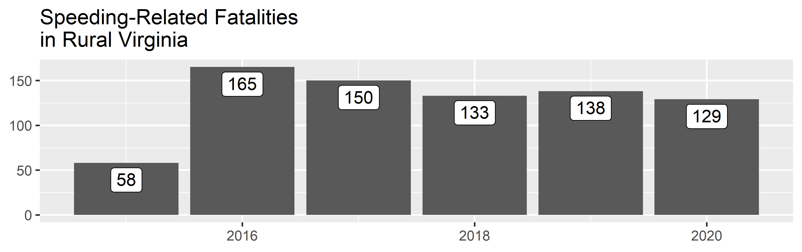
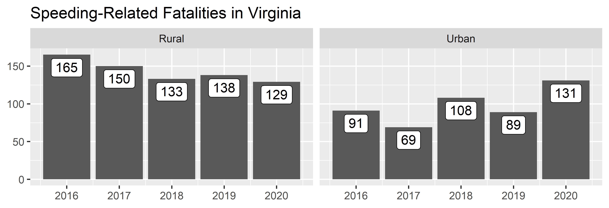
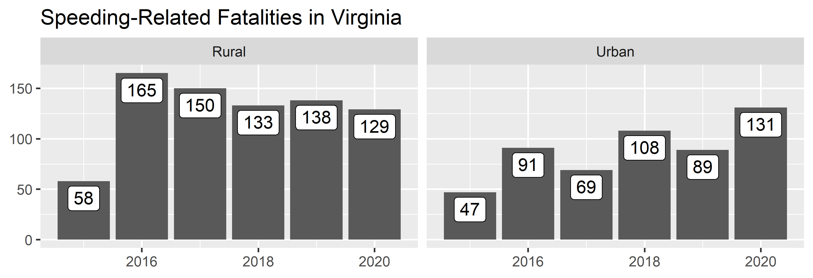
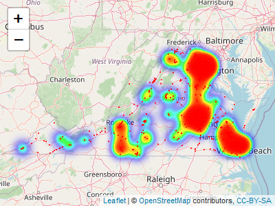
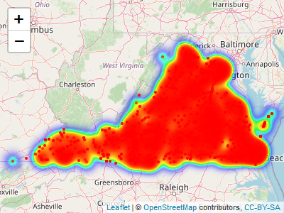

<!-- README.md is generated from README.Rmd. Please edit that file -->

# rfars

<!-- badges: start -->

[](https://travis-ci.com/s87jackson/rfars)
<!-- badges: end -->

The goal of `rfars` is to simplify the process of analyzing FARS data.
FARS stands for [Fatality Analysis Reporting
System](https://www.nhtsa.gov/research-data/fatality-analysis-reporting-system-fars),
the census of fatal crashes in the United States maintained by the
[National Highway Traffic Safety
Administration](https://www.nhtsa.gov/). The [Fatality and Injury
Reporting System Tool](https://cdan.dot.gov/query) allows users to
generate queries, and can produce simple tables and graphs. This
suffices for simple analysis, but often leaves researchers wanting more.
Digging any deeper, however, involves a time-consuming process of
downloading annual ZIP files and attempting to stitch them together -
after first combing through the immense [data
dictionary](https://crashstats.nhtsa.dot.gov/Api/Public/ViewPublication/813254)
to determine the required variables and table names. `rfars` allows
users to download FARS data back to 2016 with just two lines of code.
The result is a full, rich dataset ready for mapping, modeling, and
other downstream analysis. Helper functions are also provided to produce
common counts and comparisons.

A companion package `rfarsplus` (currently in development) will provide
exposure data and facilitate the calculation of various rates.

## Installation

You can install the latest version of `rfars` from
[GitHub](https://github.com/) with:

``` r
# install.packages("devtools")
devtools::install_github("s87jackson/rfars")
```

Then load the required packages:

## Getting and Using FARS Data

Use the `get_fars()` function to download the ZIP files from NHTSA and
save the prepared files to your hard drive. This only has to be run once
and defaults to saving everything in the current working directory.
Below we import all available data for the state of Virginia. Note that
`get_fars()` requires your permission to download the ZIP files and
store prepared CSVs locally, unless you set `proceed=TRUE`.

``` r
get_fars(states="VA", proceed=TRUE)
#> Raw data files have been saved to C:/Users/s87ja/Dropbox/Work/toXcel/FARS/rfars/FARS data/raw/
#> Preparing the 2015 files...................
#> Preparing the 2016 files...................
#> Preparing the 2017 files...................
#> Preparing the 2018 files...................
#> Preparing the 2019 files...................
#> Preparing the 2020 files...................
#> Prepared data files have been saved to C:/Users/s87ja/Dropbox/Work/toXcel/FARS/rfars/FARS data/prepared/
```

The `use_fars()` function looks in a specified directory (the working
directory by default) for certain CSV files and compiles them into a
list with five tibbles: `flat`, `multi_acc`, `multi_veh`, `multi_per`,
and `events`.

``` r
myFARS <- use_fars() 
```

The `flat` tibble contains all variables for which there is just one
value per person, vehicle, or crash (e.g., age, travel speed, lighting).
Each row corresponds to a person involved in a crash. As there may be
multiple people and/or vehicles involved in one crash, some
variable-values are repeated within a crash or vehicle. Each crash is
uniquely identified with `id`, which is a combination of `year` and
`st_case`. Note that `st_case` is not unique across years, for example,
`st_case` 510001 will appear in each year. The `id` variable attempts to
avoid this issue.

The `multi_` tibbles contain those variables for which there may be a
varying number of values for any entity (e.g., driver impairments,
vehicle events, weather conditions at time of crash). Each tibble has
the requisite data elements corresponding to the entity: `multi_acc`
includes `st_case` and `year`, `multi_veh` adds `veh_no` (vehicle
number), and `multi_per` adds `per_no` (person number).

The `events` tibble provides a sequence of numbered events for each
vehicle in each crash.

``` r
str(myFARS)
#> List of 5
#>  $ flat     : tibble [10,150 × 196] (S3: tbl_df/tbl/data.frame)
#>   ..$ year         : num [1:10150] 2015 2015 2015 2015 2015 ...
#>   ..$ state        : chr [1:10150] "Virginia" "Virginia" "Virginia" "Virginia" ...
#>   ..$ st_case      : num [1:10150] 510001 510002 510002 510003 510004 ...
#>   ..$ id           : num [1:10150] 2.02e+09 2.02e+09 2.02e+09 2.02e+09 2.02e+09 ...
#>   ..$ veh_no       : num [1:10150] 1 0 1 1 1 2 2 1 1 1 ...
#>   ..$ per_no       : num [1:10150] 1 1 1 1 1 1 2 1 1 2 ...
#>   ..$ county       : chr [1:10150] "143" "840" "840" "185" ...
#>   ..$ city         : chr [1:10150] "0" "2640" "2640" "0" ...
#>   ..$ lon          : num [1:10150] -79.2 -78.2 -78.2 -81.8 -79.3 ...
#>   ..$ lat          : num [1:10150] 37 39.2 39.2 37 37.1 ...
#>   ..$ ve_total     : num [1:10150] 1 1 1 1 2 2 2 1 1 1 ...
#>   ..$ ve_forms     : num [1:10150] 1 1 1 1 2 2 2 1 1 1 ...
#>   ..$ pvh_invl     : num [1:10150] 0 0 0 0 0 0 0 0 0 0 ...
#>   ..$ peds         : num [1:10150] 0 1 1 0 0 0 0 0 0 0 ...
#>   ..$ persons      : num [1:10150] 1 1 1 1 3 3 3 1 2 2 ...
#>   ..$ permvit      : num [1:10150] 1 1 1 1 3 3 3 1 2 2 ...
#>   ..$ pernotmvit   : num [1:10150] 0 1 1 0 0 0 0 0 0 0 ...
#>   ..$ day          : num [1:10150] 1 2 2 2 4 4 4 3 6 6 ...
#>   ..$ month        : chr [1:10150] "January" "January" "January" "January" ...
#>   ..$ day_week     : chr [1:10150] "Thursday" "Friday" "Friday" "Friday" ...
#>   ..$ hour         : num [1:10150] 15 18 18 13 15 15 15 7 1 1 ...
#>   ..$ minute       : num [1:10150] 30 59 59 55 15 15 15 58 19 19 ...
#>   ..$ nhs          : chr [1:10150] "This section IS NOT on the NHS" "This section IS NOT on the NHS" "This section IS NOT on the NHS" "This section IS NOT on the NHS" ...
#>   ..$ route        : chr [1:10150] "County Road" "Unknown" "Unknown" "County Road" ...
#>   ..$ tway_id      : chr [1:10150] "CR-668" "HANDLEY BLVD" "HANDLEY BLVD" "CR-609" ...
#>   ..$ tway_id2     : chr [1:10150] NA "S STEWARD ST" "S STEWARD ST" NA ...
#>   ..$ rur_urb      : chr [1:10150] "Rural" "Urban" "Urban" "Rural" ...
#>   ..$ func_sys     : chr [1:10150] "Major Collector" "Local" "Local" "Major Collector" ...
#>   ..$ rd_owner     : chr [1:10150] "State Highway Agency" "Not Reported" "Not Reported" "State Highway Agency" ...
#>   ..$ milept       : chr [1:10150] "68" "None" "None" "87" ...
#>   ..$ sp_jur       : chr [1:10150] "No Special Jurisdiction" "No Special Jurisdiction" "No Special Jurisdiction" "No Special Jurisdiction" ...
#>   ..$ harm_ev      : chr [1:10150] "Other Post, Other Pole or Other Supports" "Pedalcyclist" "Pedalcyclist" "Rollover/Overturn" ...
#>   ..$ man_coll     : chr [1:10150] "Not a Collision with Motor Vehicle In-Transport" "Not a Collision with Motor Vehicle In-Transport" "Not a Collision with Motor Vehicle In-Transport" "Not a Collision with Motor Vehicle In-Transport" ...
#>   ..$ reljct1      : chr [1:10150] "No" "No" "No" "No" ...
#>   ..$ reljct2      : chr [1:10150] "Non-Junction" "Intersection" "Intersection" "Non-Junction" ...
#>   ..$ typ_int      : chr [1:10150] "Not an Intersection" "T-Intersection" "T-Intersection" "Not an Intersection" ...
#>   ..$ wrk_zone     : chr [1:10150] "None" "None" "None" "None" ...
#>   ..$ rel_road     : chr [1:10150] "On Roadside" "On Roadway" "On Roadway" "Outside Trafficway" ...
#>   ..$ lgt_cond     : chr [1:10150] "Daylight" "Dark - Lighted" "Dark - Lighted" "Daylight" ...
#>   ..$ sch_bus      : chr [1:10150] "No" "No" "No" "No" ...
#>   ..$ rail         : chr [1:10150] "Not Applicable" "Not Applicable" "Not Applicable" "Not Applicable" ...
#>   ..$ not_hour     : num [1:10150] 99 19 19 13 99 99 99 99 1 1 ...
#>   ..$ not_min      : num [1:10150] 99 0 0 59 99 99 99 99 25 25 ...
#>   ..$ arr_hour     : num [1:10150] 99 19 19 14 99 99 99 99 1 1 ...
#>   ..$ arr_min      : num [1:10150] 99 5 5 8 99 99 99 99 30 30 ...
#>   ..$ hosp_hr      : num [1:10150] 99 19 19 14 99 99 99 88 1 1 ...
#>   ..$ hosp_mn      : num [1:10150] 99 20 20 36 99 99 99 88 42 42 ...
#>   ..$ fatals       : num [1:10150] 1 1 1 1 1 1 1 1 1 1 ...
#>   ..$ drunk_dr     : num [1:10150] 1 0 0 0 1 1 1 0 0 0 ...
#>   ..$ str_veh      : num [1:10150] 0 1 0 0 0 0 0 0 0 0 ...
#>   ..$ age          : chr [1:10150] "70 Years" "59 Years" "68 Years" "62 Years" ...
#>   ..$ sex          : chr [1:10150] "Male" "Female" "Female" "Female" ...
#>   ..$ per_typ      : chr [1:10150] "Driver of a Motor Vehicle In-Transport" "Bicyclist" "Driver of a Motor Vehicle In-Transport" "Driver of a Motor Vehicle In-Transport" ...
#>   ..$ inj_sev      : chr [1:10150] "Fatal Injury (K)" "Fatal Injury (K)" "No Apparent Injury (O)" "Fatal Injury (K)" ...
#>   ..$ seat_pos     : chr [1:10150] "Front Seat, Left Side" "Not a Motor Vehicle Occupant" "Front Seat, Left Side" "Front Seat, Left Side" ...
#>   ..$ rest_use     : chr [1:10150] "None Used" "Not a Motor Vehicle Occupant" "Shoulder and Lap Belt Used" "Shoulder and Lap Belt Used" ...
#>   ..$ rest_mis     : chr [1:10150] "No" "Not a Motor Vehicle Occupant" "No" "No" ...
#>   ..$ air_bag      : chr [1:10150] "Deployed- Front" "Not a Motor Vehicle Occupant" "Not Deployed" "Not Deployed" ...
#>   ..$ ejection     : chr [1:10150] "Not Ejected" "Not Applicable" "Not Ejected" "Not Ejected" ...
#>   ..$ ej_path      : chr [1:10150] "Ejection Path Not Applicable" "Ejection Path Not Applicable" "Ejection Path Not Applicable" "Ejection Path Not Applicable" ...
#>   ..$ extricat     : chr [1:10150] "Not Extricated or Not Applicable" "Not Extricated or Not Applicable" "Not Extricated or Not Applicable" "Not Extricated or Not Applicable" ...
#>   ..$ drinking     : chr [1:10150] "No (Alcohol Not Involved)" "Unknown (Police Reported)" "No (Alcohol Not Involved)" "No (Alcohol Not Involved)" ...
#>   ..$ alc_det      : chr [1:10150] "Not Reported" "Not Reported" "Not Reported" "Not Reported" ...
#>   ..$ alc_status   : chr [1:10150] "Test Given" "Test Given" "Test Given" "Test Not Given" ...
#>   ..$ atst_typ     : chr [1:10150] "Blood" "Blood" "Blood" "Test Not Given" ...
#>   ..$ alc_res      : chr [1:10150] "0.105 % BAC" "0.000 % BAC" "0.000 % BAC" "Test Not Given" ...
#>   ..$ drugs        : chr [1:10150] "No (drugs not involved)" "Unknown" "No (drugs not involved)" "No (drugs not involved)" ...
#>   ..$ drug_det     : chr [1:10150] "Not Reported" "Not Reported" "Not Reported" "Not Reported" ...
#>   ..$ dstatus      : chr [1:10150] "Test Given" "Test Given" "Test Given" "Test Not Given" ...
#>   ..$ hospital     : chr [1:10150] "EMS Unknown Mode" "EMS Unknown Mode" "Not Transported" "EMS Unknown Mode" ...
#>   ..$ doa          : chr [1:10150] "Not Applicable" "Not Applicable" "Not Applicable" "Not Applicable" ...
#>   ..$ death_da     : chr [1:10150] "1" "2" "Not Applicable (Non-Fatal)" "5" ...
#>   ..$ death_mo     : chr [1:10150] "January" "January" "Not Applicable (Non-Fatal)" "January" ...
#>   ..$ death_yr     : chr [1:10150] "2015" "2015" "Not Applicable (Non-fatal)" "2015" ...
#>   ..$ death_hr     : num [1:10150] 17 19 88 20 15 88 88 8 1 88 ...
#>   ..$ death_mn     : num [1:10150] 51 39 88 15 37 88 88 24 45 88 ...
#>   ..$ death_tm     : chr [1:10150] "1751" "1939" "8888" "2015" ...
#>   ..$ lag_hrs      : num [1:10150] 2 0 999 78 0 999 999 0 0 999 ...
#>   ..$ lag_mins     : num [1:10150] 21 40 99 20 22 99 99 26 26 99 ...
#>   ..$ work_inj     : chr [1:10150] "No" "No" "Not Applicable (not a fatality)" "No" ...
#>   ..$ hispanic     : chr [1:10150] "Non-Hispanic" "Non-Hispanic" "Not A Fatality (not Applicable)" "Non-Hispanic" ...
#>   ..$ location     : chr [1:10150] "Occupant of a Motor Vehicle" "At Intersection - Not In Crosswalk" "Occupant of a Motor Vehicle" "Occupant of a Motor Vehicle" ...
#>   ..$ numoccs      : chr [1:10150] "01" NA "01" "01" ...
#>   ..$ unittype     : chr [1:10150] "Motor Vehicle In-Transport (Inside or Outside the Trafficway)" NA "Motor Vehicle In-Transport (Inside or Outside the Trafficway)" "Motor Vehicle In-Transport (Inside or Outside the Trafficway)" ...
#>   ..$ hit_run      : chr [1:10150] "No" NA "No" "No" ...
#>   ..$ reg_stat     : chr [1:10150] "Virginia" NA "Virginia" "Virginia" ...
#>   ..$ owner        : chr [1:10150] "Driver (in this crash) was  Registered Owner" NA "Driver (in this crash) was  Registered Owner" "Driver (in this crash) was  Registered Owner" ...
#>   ..$ make         : chr [1:10150] "Volvo" NA "Ford" "Chevrolet" ...
#>   ..$ model        : num [1:10150] 43 NA 401 16 38 39 39 481 404 404 ...
#>   ..$ mak_mod      : chr [1:10150] "Volvo 70 Series (For XC70 for 2014 on, use model code 402)" NA "Ford Bronco (thru 1977)/Bronco II/Explorer/Explorer Sport" "Chevrolet Cavalier" ...
#>   ..$ body_typ     : chr [1:10150] "Station Wagon (excluding van and truck based)" NA "Compact Utility (Utility Vehicle Categories \"Small\" and \"Midsize\")" "2-door sedan,hardtop,coupe" ...
#>   ..$ mod_year     : chr [1:10150] "2001" NA "2004" "1999" ...
#>   ..$ vin          : chr [1:10150] "YV1SZ58D1110" NA "1FMZU73W64ZA" "1G1JC1246X72" ...
#>   ..$ tow_veh      : chr [1:10150] "No Trailing Units" NA "No Trailing Units" "No Trailing Units" ...
#>   ..$ j_knife      : chr [1:10150] "Not an Articulated Vehicle" NA "Not an Articulated Vehicle" "Not an Articulated Vehicle" ...
#>   ..$ mcarr_i1     : chr [1:10150] "Not Applicable" NA "Not Applicable" "Not Applicable" ...
#>   ..$ mcarr_i2     : chr [1:10150] "Not Applicable" NA "Not Applicable" "Not Applicable" ...
#>   ..$ mcarr_id     : chr [1:10150] "Not Applicable" NA "Not Applicable" "Not Applicable" ...
#>   ..$ v_config     : chr [1:10150] "Not Applicable" NA "Not Applicable" "Not Applicable" ...
#>   .. [list output truncated]
#>  $ multi_acc:'data.frame':   9939 obs. of  5 variables:
#>   ..$ state  : chr [1:9939] "Virginia" "Virginia" "Virginia" "Virginia" ...
#>   ..$ st_case: num [1:9939] 510001 510001 510002 510002 510003 ...
#>   ..$ name   : chr [1:9939] "weather" "weather" "weather" "weather" ...
#>   ..$ value  : chr [1:9939] "Clear" "Cloudy" "Clear" "Cloudy" ...
#>   ..$ year   : num [1:9939] 2015 2015 2015 2015 2015 ...
#>  $ multi_veh:'data.frame':   92933 obs. of  6 variables:
#>   ..$ state  : chr [1:92933] "Virginia" "Virginia" "Virginia" "Virginia" ...
#>   ..$ st_case: num [1:92933] 510001 510002 510003 510004 510004 ...
#>   ..$ veh_no : num [1:92933] 1 1 1 1 2 1 1 1 1 1 ...
#>   ..$ name   : chr [1:92933] "vehiclesf" "vehiclesf" "vehiclesf" "vehiclesf" ...
#>   ..$ value  : chr [1:92933] "None" "None" "None" "None" ...
#>   ..$ year   : num [1:92933] 2015 2015 2015 2015 2015 ...
#>  $ multi_per:'data.frame':   56963 obs. of  7 variables:
#>   ..$ state  : chr [1:56963] "Virginia" "Virginia" "Virginia" "Virginia" ...
#>   ..$ st_case: num [1:56963] 510001 510002 510002 510003 510004 ...
#>   ..$ veh_no : num [1:56963] 1 0 1 1 1 2 2 1 1 1 ...
#>   ..$ per_no : num [1:56963] 1 1 1 1 1 1 2 1 1 2 ...
#>   ..$ name   : chr [1:56963] "race" "race" "race" "race" ...
#>   ..$ value  : chr [1:56963] "White" "White" "Not a Fatality (not Applicable)" "White" ...
#>   ..$ year   : num [1:56963] 2015 2015 2015 2015 2015 ...
#>  $ events   :'data.frame':   16162 obs. of  7 variables:
#>   ..$ state    : chr [1:16162] "Virginia" "Virginia" "Virginia" "Virginia" ...
#>   ..$ st_case  : num [1:16162] 510001 510001 510001 510001 510001 ...
#>   ..$ veh_no   : num [1:16162] 1 1 1 1 1 1 1 1 1 1 ...
#>   ..$ veventnum: num [1:16162] 1 2 3 4 5 1 1 2 3 4 ...
#>   ..$ soe      : chr [1:16162] "Ran Off Roadway - Right" "Re-entering Roadway" "Ran Off Roadway - Left" "Other Post, Other Pole or Other Supports" ...
#>   ..$ aoi      : chr [1:16162] "Non-Harmful Event" "Non-Harmful Event" "Non-Harmful Event" "11 Clock Point" ...
#>   ..$ year     : num [1:16162] 2015 2015 2015 2015 2015 ...
#>  - attr(*, "class")= chr [1:2] "list" "FARS"
```

You can review the list of variables to help guide your analysis with:

``` r
View(fars_varnames)
```

## Counts

A first step in many transportation safety analyses involves counting
the number of relevant crashes, fatalities, or people involved.
`counts()` lets users specify *what* to count, *where* to count them
(rural/urban and/or in specified states), *who* to include, which
*years* to include and an aggregation *interval* (annually or monthly),
and factors *involved* in the crash. It returns a simple tibble that can
be easily piped into `ggplot()` to quickly visualize counts.

``` r
counts(
  myFARS,
  what = "crashes",
  interval = c("year")
  ) %>%
  ggplot(aes(x=date, y=n, label=scales::comma(n))) + 
    geom_col() + 
    geom_label(vjust=1.2) +
    labs(x=NULL, y=NULL, title = "Fatal Crashes in Virginia")
```



``` r
counts(
  myFARS,
  what = "fatalities",
  interval = c("year")
  ) %>%
  ggplot(aes(x=date, y=n, label=scales::comma(n))) + 
    geom_col() + 
    geom_label(vjust=1.2) +
    labs(x=NULL, y=NULL, title = "Fatalities in Virginia")
```



``` r
counts(myFARS,
       what = "fatalities",
       where = "rural",
       interval = c("year")
       ) %>%
  ggplot(aes(x=date, y=n, label=scales::comma(n))) + 
    geom_col() + 
    geom_label(vjust=1.2) +
    labs(x=NULL, y=NULL, title = "Rural Fatalities in Virginia")
```



``` r
counts(myFARS,
       what = "fatalities",
       where = "rural",
       interval = c("year"),
       involved = "speeding"
       ) %>%
  ggplot(aes(x=date, y=n, label=scales::comma(n))) + 
    geom_col() + 
    geom_label(vjust=1.2) +
    labs(x=NULL, y=NULL, title = "Speeding-Related Fatalities\nin Rural Virginia")
```



We can combine two `counts()` results to make a comparison. Here we
compare the number of speeding-related fatalities in rural and urban
Virginia:

``` r
bind_rows(
  counts(myFARS,
       what = "fatalities",
       where = "rural",
       interval = c("year"),
       involved = "speeding"
       ) %>%
    mutate(where = "Rural"),
  counts(myFARS,
       what = "fatalities",
       where = "urban",
       interval = c("year"),
       involved = "speeding"
       ) %>%
    mutate(where = "Urban")
    ) %>%
  ggplot(aes(x=date, y=n, label=scales::comma(n))) + 
    geom_col() + 
    geom_label(vjust=1.2) +
    facet_wrap(.~where) +
    labs(x=NULL, y=NULL, title = "Speeding-Related Fatalities in Virginia", fill=NULL)
```



## Mapping

We can take advantage of having access to the full data with maps. Here
we map pedestrian and bicyclist fatalities in Virginia:

``` r
counts(
  myFARS, 
  what = "crashes", 
  involved = "pedbike", 
  filterOnly = TRUE
  ) %>%
leaflet() %>%
  addTiles() %>%
  addHeatmap(group = "Heatmap", radius=10, blur=20, minOpacity = .01, max = .2, cellSize = 1) %>%
  addCircleMarkers(
    radius = 1,
    color = "red",
    stroke = FALSE,
    fillOpacity = 0.7, group = "Crash Locations") 
#> Assuming "lon" and "lat" are longitude and latitude, respectively
#> Assuming "lon" and "lat" are longitude and latitude, respectively
```



Drug-related crashes:

``` r
counts(
  myFARS, 
  what = "crashes", 
  involved = "drugs", 
  filterOnly = TRUE
  ) %>%
  filter(!is.na(lat), !is.na(lon)) %>%
leaflet() %>%
  addTiles() %>%
  addHeatmap(group = "Heatmap", radius=10, blur=20, minOpacity = .01, max = .2, cellSize = 1) %>%
  addCircleMarkers(
    radius = 1,
    color = "red",
    stroke = FALSE,
    fillOpacity = 0.7, group = "Crash Locations") 
#> Assuming "lon" and "lat" are longitude and latitude, respectively
#> Assuming "lon" and "lat" are longitude and latitude, respectively
```



Young drivers:

``` r
counts(
  myFARS, 
  what = "crashes", 
  involved = "young driver", 
  filterOnly = TRUE
  ) %>%
  filter(!is.na(lat), !is.na(lon)) %>%
leaflet() %>%
  addTiles() %>%
  addHeatmap(group = "Heatmap", radius=10, blur=20, minOpacity = .01, max = .2, cellSize = 1) %>%
  addCircleMarkers(
    radius = 1,
    color = "red",
    stroke = FALSE,
    fillOpacity = 0.7, group = "Crash Locations") 
#> Note: Young drivers are defined as those between the ages of 15 and 20.
#> Warning in mask$eval_all_mutate(quo): NAs introduced by coercion
#> Assuming "lon" and "lat" are longitude and latitude, respectively
#> Assuming "lon" and "lat" are longitude and latitude, respectively
```



## Modeling

Having access to the full dataset also allows us to develop statistical
models. Here we fit a simple model of injury severity as a function of
age and restraint use. It tells us that the average severity score among
motor vehicle drivers and occupants wearing seatbelts (both the lap and
shoulder belts) is 1.7 (close to, but less than “Suspected Minor Injury
(B)”). Partial seatbelt use increases the predicted score to 2.1
(slightly above “Suspected Minor Injury (B)”). Not wearing any seatbelt,
however increases the predicted score to 3.2 (slightly above “Suspected
Serious Injury (A)”).

``` r
# table(myFARS$flat$inj_sev)
# table(myFARS$flat$rest_use, useNA = "ifany")
# table(myFARS$flat$per_typ, useNA = "ifany")

myFARS$flat %>%
  filter(rest_use %in% c("Lap Belt Only Used",
                         "Shoulder Belt Only Used",
                         "None Used / Not Applicable",
                         "None Used/Not Applicable",
                         "Shoulder and Lap Belt Used"),
         per_typ %in% c("Driver of a Motor Vehicle In-Transport",
                        "Passenger of a Motor Vehicle In-Transport")
         ) %>%
  mutate(
    rest_use = case_when(
      rest_use %in% c("Lap Belt Only Used", "Shoulder Belt Only Used") ~ "Partial",
      rest_use %in% c("None Used / Not Applicable", "None Used/Not Applicable") ~ "None",
      rest_use %in% c("Shoulder and Lap Belt Used") ~ "Full",
      TRUE ~ "Unknown"
      ) %>%
      as.factor() %>%
      relevel(ref = "Full"),
    kabco = case_when(
      inj_sev == "Fatal Injury (K)" ~ 4,
      inj_sev %in% c("Suspected Serious Injury (A)", 
                     "Suspected Serious Injury(A)") ~ 3,
      inj_sev %in% c("Suspected Minor Injury (B)", 
                     "Suspected Minor Injury(B)") ~ 2,
      inj_sev == "Possible Injury (C)" ~ 1,
      inj_sev == "No Apparent Injury (O)" ~ 0,
      TRUE ~ as.numeric(NA)
      ),
    age_n = gsub("\\D+","", age) %>% as.numeric()) %>%
  lm(kabco ~ age_n + rest_use, data = .) %>%
  summary()
#> 
#> Call:
#> lm(formula = kabco ~ age_n + rest_use, data = .)
#> 
#> Residuals:
#>     Min      1Q  Median      3Q     Max 
#> -3.9365 -1.2017  0.2468  1.0656  2.2673 
#> 
#> Coefficients:
#>                  Estimate Std. Error t value Pr(>|t|)    
#> (Intercept)     1.6777025  0.0420932  39.857  < 2e-16 ***
#> age_n           0.0091662  0.0008356  10.969  < 2e-16 ***
#> rest_useNone    1.5072070  0.0368817  40.866  < 2e-16 ***
#> rest_usePartial 0.4320574  0.1496019   2.888  0.00389 ** 
#> ---
#> Signif. codes:  0 '***' 0.001 '**' 0.01 '*' 0.05 '.' 0.1 ' ' 1
#> 
#> Residual standard error: 1.412 on 7179 degrees of freedom
#>   (45 observations deleted due to missingness)
#> Multiple R-squared:  0.1926, Adjusted R-squared:  0.1922 
#> F-statistic: 570.8 on 3 and 7179 DF,  p-value: < 2.2e-16
```
