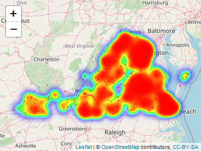
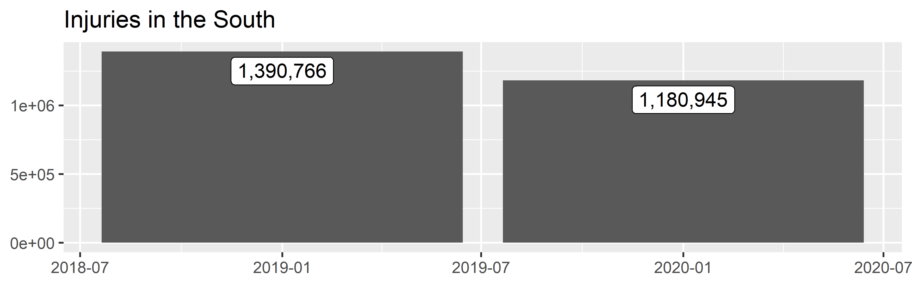
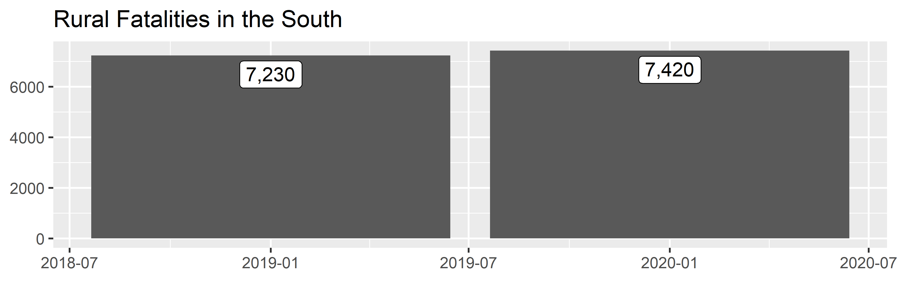
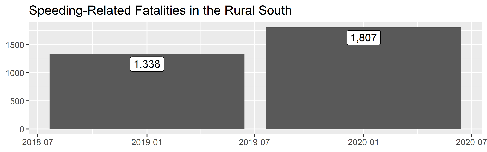

<!-- README.md is generated from README.Rmd. Please edit that file -->

# rfars 

<!-- badges: start -->

[](https://cran.r-project.org/package=rfars)
[](https://github.com/s87jackson/rfars/actions/workflows/R-CMD-check.yaml)
[](https://CRAN.R-project.org/package=rfars)
<!-- badges: end -->

The goal of `rfars` is to facilitate transportation safety analysis by
simplifying the process of extracting data from official crash
databases. The [National Highway Traffic Safety
Administration](https://www.nhtsa.gov/) collects and publishes a census
of fatal crashes in the [Fatality Analysis Reporting
System](https://www.nhtsa.gov/research-data/fatality-analysis-reporting-system-fars)
and a sample of fatal and non-fatal crashes in the [Crash Report
Sampling
System](https://www.nhtsa.gov/crash-data-systems/crash-report-sampling-system)
(an evolution of the [General Estimates
System](https://www.nhtsa.gov/national-automotive-sampling-system/nass-general-estimates-system)).
The [Fatality and Injury Reporting System
Tool](https://cdan.dot.gov/query) allows users to query these databases,
and can produce simple tables and graphs. This suffices for simple
analysis, but often leaves researchers wanting more. Digging any deeper,
however, involves a time-consuming process of downloading annual ZIP
files and attempting to stitch them together - after first combing
through immense data dictionaries to determine the required variables
and table names.

`rfars` allows users to download FARS and GES/CRSS data back to 2011
with just one line of code. The result is a full, rich dataset ready for
mapping, modeling, and other downstream analysis. Helper functions are
also provided to produce common counts and comparisons.

## Installation

You can install the latest version of `rfars` from
[GitHub](https://github.com/) with:

``` r
# install.packages("devtools")
devtools::install_github("s87jackson/rfars")
```

or the CRAN stable release with:

``` r
install.packages("rfars")
```

Then load rfars and some helpful packages:

``` r
library(rfars)
library(dplyr)
library(ggplot2)
library(leaflet)
library(leaflet.extras)
```

## Getting and Using FARS Data

Use the `get_fars()` function to bring FARS data into the current
environment and optionally save an RDS file for future use (faster than
downloading anew). This is done by (a) downloading the data to a
temporary directory, (b) downloading to a permanent directory, or (c)
importing from a permanent directory. After data is downloaded to a
permanent directory, the function will look there rather than
downloading the data again. If a year of data is requested but not
found, R will ask your permission to download the missing data.

Here we get three years of data for Virginia:

``` r
myFARS <- get_fars(years = 2019:2021, states = "VA")
```

This returns a ‘FARS’ object: a list with six tibbles: `flat`,
`multi_acc`, `multi_veh`, `multi_per`, `events`, and `codebook`.

The `flat` tibble contains all variables for which there is just one
value per crash (“accident”), vehicle, or person (e.g., weather
conditions, travel speed, age). Each row corresponds to a person
involved in a crash. As there may be multiple people and/or vehicles
involved in one crash, some variable-values are repeated within a crash
or vehicle. Each crash is uniquely identified with `id`, which is a
combination of `year` and `st_case`. Note that `st_case` is not unique
across years, for example, `st_case` 510001 will appear in each year.
The `id` variable attempts to avoid this issue.

Please review the [FARS Analytical User’s
Manual](https://crashstats.nhtsa.dot.gov/Api/Public/ViewPublication/813417)
for more information.

``` r
glimpse(myFARS$flat)
#> Rows: 5,465
#> Columns: 199
#> $ year          <dbl> 2019, 2019, 2019, 2019, 2019, 2019, 2019, 2019, 2019, 20…
#> $ state         <chr> "Virginia", "Virginia", "Virginia", "Virginia", "Virgini…
#> $ st_case       <dbl> 510001, 510001, 510002, 510002, 510003, 510003, 510004, …
#> $ id            <dbl> 2019510001, 2019510001, 2019510002, 2019510002, 20195100…
#> $ veh_no        <dbl> 0, 1, 1, 2, 1, 1, 0, 1, 1, 1, 2, 0, 1, 1, 1, 2, 0, 1, 1,…
#> $ per_no        <dbl> 1, 1, 1, 1, 1, 2, 1, 1, 1, 2, 1, 1, 1, 1, 2, 1, 1, 1, 1,…
#> $ county        <dbl> 760, 760, 137, 137, 53, 53, 107, 107, 175, 175, 175, 157…
#> $ city          <dbl> 2060, 2060, 0, 0, 0, 0, 0, 0, 0, 0, 0, 0, 0, 0, 0, 0, 19…
#> $ lon           <dbl> -77.48444, -77.48444, -77.94240, -77.94240, -77.66604, -…
#> $ lat           <dbl> 37.50924, 37.50924, 38.19840, 38.19840, 37.00784, 37.007…
#> $ acc_type      <chr> NA, "C13-Single Driver-Forward Impact-Pedestrian/ Animal…
#> $ age           <chr> "17 Years", "42 Years", "83 Years", "44 Years", "50 Year…
#> $ air_bag       <chr> "Not a Motor Vehicle Occupant", "Reported as Deployment …
#> $ alc_det       <chr> "Not Reported", "Not Reported", "Not Reported", "Not Rep…
#> $ alc_res       <chr> "0.000 % BAC", "Test Not Given", "0.000 % BAC", "Test No…
#> $ alc_status    <chr> "Test Given", "Test Not Given", "Test Given", "Test Not …
#> $ arr_hour      <chr> "Unknown EMS Scene Arrival Hour", "Unknown EMS Scene Arr…
#> $ arr_min       <chr> "Unknown EMS Scene Arrival Minutes", "Unknown EMS Scene …
#> $ atst_typ      <chr> "Blood", "Test Not Given", "Blood", "Test Not Given", "T…
#> $ bikecgp       <chr> "Not a Cyclist", NA, NA, NA, NA, NA, "Not a Cyclist", NA…
#> $ bikectype     <chr> "Not a Cyclist", NA, NA, NA, NA, NA, "Not a Cyclist", NA…
#> $ bikedir       <chr> "Not a Cyclist", NA, NA, NA, NA, NA, "Not a Cyclist", NA…
#> $ bikeloc       <chr> "Not a Cyclist", NA, NA, NA, NA, NA, "Not a Cyclist", NA…
#> $ bikepos       <chr> "Not a Cyclist", NA, NA, NA, NA, NA, "Not a Cyclist", NA…
#> $ body_typ      <chr> NA, "4-door sedan, hardtop", "2-door sedan,hardtop,coupe…
#> $ bus_use       <chr> NA, "Not a Bus", "Not a Bus", "Not a Bus", "Not a Bus", …
#> $ cargo_bt      <chr> NA, "Not Applicable (N/A)", "Not Applicable (N/A)", "Not…
#> $ cdl_stat      <chr> NA, "No (CDL)", "No (CDL)", "No (CDL)", "No (CDL)", "No …
#> $ cityname      <chr> "RICHMOND", "RICHMOND", "NOT APPLICABLE", "NOT APPLICABL…
#> $ countyname    <chr> "RICHMOND (760)", "RICHMOND (760)", "ORANGE (137)", "ORA…
#> $ day           <dbl> 1, 1, 2, 2, 3, 3, 4, 4, 7, 7, 7, 6, 6, 6, 6, 6, 7, 7, 6,…
#> $ day_week      <chr> "Tuesday", "Tuesday", "Wednesday", "Wednesday", "Thursda…
#> $ death_da      <chr> "1", "Not Applicable (Non-Fatal)", "2", "Not Applicable …
#> $ death_hr      <chr> "6:00-6:59", "Not Applicable (Non-fatal)", "15:00-15:59"…
#> $ death_mn      <chr> "32", "Not Applicable (Non-fatal)", "35", "Not Applicabl…
#> $ death_mo      <chr> "January", "Not Applicable (Non-Fatal)", "January", "Not…
#> $ death_tm      <chr> NA, "Not Applicable (Non-fatal)", NA, "Not Applicable (N…
#> $ death_yr      <chr> "2019", "Not Applicable (Non-fatal)", "2019", "Not Appli…
#> $ deaths        <dbl> NA, 0, 1, 0, 1, 1, NA, 0, 1, 1, 0, NA, 0, 1, 1, 0, NA, 0…
#> $ deformed      <chr> NA, "Reported as Unknown", "Disabling Damage", "Disablin…
#> $ doa           <chr> "Not Applicable", "Not Applicable", "Died at Scene", "No…
#> $ dr_drink      <chr> NA, "No", "No", "No", "No", "No", NA, "Yes", "No", "No",…
#> $ dr_hgt        <chr> NA, NA, NA, NA, NA, NA, NA, NA, NA, NA, NA, NA, NA, NA, …
#> $ dr_pres       <chr> NA, "Yes", "Yes", "Yes", "Yes", "Yes", NA, "Yes", "Yes",…
#> $ dr_wgt        <chr> NA, "160 lbs.", "220 lbs.", "220 lbs.", "170 lbs.", "170…
#> $ dr_zip        <chr> NA, NA, NA, NA, NA, NA, NA, NA, NA, NA, NA, NA, NA, NA, …
#> $ drinking      <chr> "Not Reported", "Reported as Unknown", "No (Alcohol Not …
#> $ drug_det      <chr> "Not Reported", "Not Reported", "Not Reported", "Not Rep…
#> $ drugs         <chr> "Reported as Unknown", "Reported as Unknown", "No (drugs…
#> $ drunk_dr      <dbl> 0, 0, 0, 0, 0, 0, 1, 1, 0, 0, 0, 0, 0, 0, 0, 0, 0, 0, 0,…
#> $ dstatus       <chr> "Test Given", "Test Not Given", "Test Given", "Test Not …
#> $ ej_path       <chr> "Ejection Path Not Applicable", "Ejection Path Not Appli…
#> $ ejection      <chr> "Not Applicable", "Not Ejected", "Not Ejected", "Not Eje…
#> $ emer_use      <chr> NA, "Not Applicable", "Not Applicable", "Not Applicable"…
#> $ extricat      <chr> "Not Extricated or Not Applicable", "Not Extricated or N…
#> $ fatals        <dbl> 1, 1, 1, 1, 1, 1, 1, 1, 1, 1, 1, 1, 1, 1, 1, 1, 1, 1, 1,…
#> $ fire_exp      <chr> NA, "No or Not Reported", "No or Not Reported", "No or N…
#> $ first_mo      <chr> NA, "October", "No Record", "No Record", "No Record", "N…
#> $ first_yr      <chr> NA, "2016", "No Record", "No Record", "No Record", "No R…
#> $ func_sys      <chr> "Principal Arterial - Other", "Principal Arterial - Othe…
#> $ gvwr          <chr> NA, "Not Applicable", "Not Applicable", "Not Applicable"…
#> $ harm_ev       <chr> "Pedestrian", "Pedestrian", "Motor Vehicle In-Transport"…
#> $ haz_cno       <chr> NA, "Not Applicable", "Not Applicable", "Not Applicable"…
#> $ haz_id        <chr> NA, "Not Applicable", "Not Applicable", "Not Applicable"…
#> $ haz_inv       <chr> NA, "No", "No", "No", "No", "No", NA, "No", "No", "No", …
#> $ haz_plac      <chr> NA, "Not Applicable", "Not Applicable", "Not Applicable"…
#> $ haz_rel       <chr> NA, "Not Applicable", "Not Applicable", "Not Applicable"…
#> $ helm_mis      <chr> "Not a Motor Vehicle Occupant", "None Used/Not Applicabl…
#> $ helm_use      <chr> "Not a Motor Vehicle Occupant", "Not Applicable", "Not A…
#> $ hispanic      <chr> "Non-Hispanic", "Not A Fatality (not Applicable)", "Non-…
#> $ hit_run       <chr> NA, "Yes", "No", "No", "No", "No", NA, "No", "No", "No",…
#> $ hosp_hr       <chr> "Unknown", "Unknown", "Unknown", "Unknown", "Unknown", "…
#> $ hosp_mn       <chr> "Unknown EMS Hospital Arrival Time", "Unknown EMS Hospit…
#> $ hospital      <chr> "EMS Unknown Mode", "Not Transported", "Not Transported"…
#> $ hour          <chr> "5:00am-5:59am", "5:00am-5:59am", "3:00pm-3:59pm", "3:00…
#> $ impact1       <chr> NA, "12 Clock Point", "12 Clock Point", "12 Clock Point"…
#> $ inj_sev       <chr> "Fatal Injury (K)", "No Apparent Injury (O)", "Fatal Inj…
#> $ j_knife       <chr> NA, "Not an Articulated Vehicle", "Not an Articulated Ve…
#> $ l_compl       <chr> NA, "Valid license for this class vehicle", "Valid licen…
#> $ l_endors      <chr> NA, "No Endorsements required for this vehicle", "No End…
#> $ l_restri      <chr> NA, "Restrictions, Compliance Unknown", "No Restrictions…
#> $ l_state       <chr> NA, "Virginia", "Virginia", "Virginia", "Virginia", "Vir…
#> $ l_status      <chr> NA, "Valid", "Valid", "Valid", "Valid", "Valid", NA, "Va…
#> $ l_type        <chr> NA, "Full Driver License", "Full Driver License", "Full …
#> $ lag_hrs       <chr> NA, "Unknown", NA, "Unknown", "Unknown", NA, NA, "Unknow…
#> $ lag_mins      <chr> NA, "Unknown", NA, "Unknown", "Unknown", NA, NA, "Unknow…
#> $ last_mo       <chr> NA, "March", "No Record", "No Record", "No Record", "No …
#> $ last_yr       <chr> NA, "2018", "No Record", "No Record", "No Record", "No R…
#> $ lgt_cond      <chr> "Dark - Lighted", "Dark - Lighted", "Daylight", "Dayligh…
#> $ location      <chr> "Not at Intersection - On Roadway, Not in Marked Crosswa…
#> $ m_harm        <chr> NA, "Pedestrian", "Motor Vehicle In-Transport", "Motor V…
#> $ mak_mod       <chr> NA, "Chevrolet Malibu/Malibu Maxx", "Pontiac Grand AM", …
#> $ make          <chr> NA, "Chevrolet", "Pontiac", "Toyota", "Chevrolet", "Chev…
#> $ man_coll      <chr> "The First Harmful Event was Not a Collision with a Moto…
#> $ mcarr_i1      <chr> NA, "Not Applicable", "Not Applicable", "Not Applicable"…
#> $ mcarr_i2      <chr> NA, "Not Applicable", "Not Applicable", "Not Applicable"…
#> $ mcarr_id      <chr> NA, "Not Applicable", "Not Applicable", "Not Applicable"…
#> $ milept        <chr> NA, NA, NA, NA, NA, NA, NA, NA, NA, NA, NA, NA, NA, NA, …
#> $ minute        <dbl> 48, 48, 35, 35, 5, 5, 30, 30, 47, 47, 47, 5, 5, 36, 36, …
#> $ mod_year      <chr> NA, NA, NA, NA, NA, NA, NA, NA, NA, NA, NA, NA, NA, NA, …
#> $ model         <dbl> NA, 37, 18, 46, 473, 473, NA, 402, 471, 471, 482, NA, 40…
#> $ month         <chr> "January", "January", "January", "January", "January", "…
#> $ motdir        <chr> "Not Applicable", NA, NA, NA, NA, NA, "Not Applicable", …
#> $ motman        <chr> "Not Applicable", NA, NA, NA, NA, NA, "Not Applicable", …
#> $ nhs           <chr> "This section IS ON the NHS", "This section IS ON the NH…
#> $ nmhelmet      <chr> "Not Reported", NA, NA, NA, NA, NA, "Not Reported", NA, …
#> $ nmlight       <chr> "Not Reported", NA, NA, NA, NA, NA, "Not Reported", NA, …
#> $ nmothpre      <chr> "Not Reported", NA, NA, NA, NA, NA, "Not Reported", NA, …
#> $ nmothpro      <chr> "Not Reported", NA, NA, NA, NA, NA, "Not Reported", NA, …
#> $ nmpropad      <chr> "Not Reported", NA, NA, NA, NA, NA, "Not Reported", NA, …
#> $ nmrefclo      <chr> "Not Reported", NA, NA, NA, NA, NA, "Not Reported", NA, …
#> $ not_hour      <chr> "Unknown", "Unknown", "Unknown", "Unknown", "Unknown", "…
#> $ not_min       <chr> "Unknown", "Unknown", "Unknown", "Unknown", "Unknown", "…
#> $ numoccs       <chr> NA, "Unknown", "01", "01", "02", "02", NA, "01", "02", "…
#> $ owner         <chr> NA, "Driver (in this crash) was  Registered Owner", "Dri…
#> $ p_crash1      <chr> NA, "Going Straight", "Going Straight", "Going Straight"…
#> $ p_crash2      <chr> NA, "Pedestrian in road", "Over the lane line on left si…
#> $ p_crash3      <chr> NA, "Unknown/Not Reported", "No Avoidance Maneuver", "No…
#> $ pbcwalk       <chr> "None Noted", NA, NA, NA, NA, NA, "None Noted", NA, NA, …
#> $ pbswalk       <chr> "None Noted", NA, NA, NA, NA, NA, "None Noted", NA, NA, …
#> $ pbszone       <chr> "None Noted", NA, NA, NA, NA, NA, "None Noted", NA, NA, …
#> $ pcrash4       <chr> NA, "Tracking", "Tracking", "Tracking", "Skidding latera…
#> $ pcrash5       <chr> NA, "Stayed in original travel lane", "Stayed on roadway…
#> $ pedcgp        <chr> "Pedestrian in Roadway - Circumstances Unknown", NA, NA,…
#> $ pedctype      <chr> "Lying in Roadway", NA, NA, NA, NA, NA, "Walking/Running…
#> $ peddir        <chr> "Not Applicable", NA, NA, NA, NA, NA, "Not Applicable", …
#> $ pedleg        <chr> "Not Applicable", NA, NA, NA, NA, NA, "Not Applicable", …
#> $ pedloc        <chr> "Not At Intersection", NA, NA, NA, NA, NA, "Not At Inter…
#> $ pedpos        <chr> "Travel Lane", NA, NA, NA, NA, NA, "Travel Lane", NA, NA…
#> $ peds          <dbl> 1, 1, 0, 0, 0, 0, 1, 1, 0, 0, 0, 1, 1, 0, 0, 0, 1, 1, 0,…
#> $ pedsnr        <chr> "Not Applicable", NA, NA, NA, NA, NA, "Not Applicable", …
#> $ per_typ       <chr> "Pedestrian", "Driver of a Motor Vehicle In-Transport", …
#> $ permvit       <dbl> 1, 1, 2, 2, 2, 2, 1, 1, 3, 3, 3, 1, 1, 3, 3, 3, 1, 1, 1,…
#> $ pernotmvit    <dbl> 1, 1, 0, 0, 0, 0, 1, 1, 0, 0, 0, 1, 1, 0, 0, 0, 1, 1, 0,…
#> $ persons       <dbl> 1, 1, 2, 2, 2, 2, 1, 1, 3, 3, 3, 1, 1, 3, 3, 3, 1, 1, 1,…
#> $ prev_acc      <chr> NA, "1", "None", "None", "None", "None", NA, "None", "No…
#> $ prev_dwi      <chr> NA, "None", "None", "None", "None", "None", NA, "None", …
#> $ prev_oth      <chr> NA, "None", "None", "None", "None", "None", NA, "None", …
#> $ prev_spd      <chr> NA, "1", "None", "None", "None", "None", NA, "None", "No…
#> $ prev_sus1     <chr> NA, "None", "None", "None", "None", "None", NA, "None", …
#> $ prev_sus2     <chr> NA, "None", "None", "None", "None", "None", NA, "None", …
#> $ prev_sus3     <chr> NA, "1", "None", "None", "None", "None", NA, "None", "No…
#> $ pvh_invl      <dbl> 0, 0, 0, 0, 0, 0, 0, 0, 0, 0, 0, 0, 0, 0, 0, 0, 0, 0, 0,…
#> $ rail          <chr> "Not Applicable", "Not Applicable", "Not Applicable", "N…
#> $ rd_owner      <chr> "City or Municipal Highway Agency", "City or Municipal H…
#> $ reg_stat      <chr> NA, "Virginia", "Virginia", "Virginia", "Virginia", "Vir…
#> $ rel_road      <chr> "On Roadway", "On Roadway", "On Roadway", "On Roadway", …
#> $ reljct1       <chr> "No", "No", "No", "No", "No", "No", "No", "No", "No", "N…
#> $ reljct2       <chr> "Non-Junction", "Non-Junction", "Non-Junction", "Non-Jun…
#> $ rest_mis      <chr> "Not a Motor Vehicle Occupant", "None Used/Not Applicabl…
#> $ rest_use      <chr> "Not a Motor Vehicle Occupant", "None Used/Not Applicabl…
#> $ rolinloc      <chr> NA, "No Rollover", "No Rollover", "No Rollover", "On Med…
#> $ rollover      <chr> NA, "No Rollover", "No Rollover", "No Rollover", "Rollov…
#> $ route         <chr> "U.S. Highway", "U.S. Highway", "U.S. Highway", "U.S. Hi…
#> $ rur_urb       <chr> "Urban", "Urban", "Rural", "Rural", "Rural", "Rural", "R…
#> $ sch_bus       <chr> "No", "No", "No", "No", "No", "No", "No", "No", "No", "N…
#> $ seat_pos      <chr> "Not a Motor Vehicle Occupant", "Front Seat, Left Side",…
#> $ sex           <chr> "Female", "Female", "Male", "Male", "Male", "Male", "Fem…
#> $ sp_jur        <chr> "No Special Jurisdiction", "No Special Jurisdiction", "N…
#> $ spec_use      <chr> NA, "No Special Use", "No Special Use", "No Special Use"…
#> $ speedrel      <chr> NA, "No", "No", "No", "No", "No", NA, "No", "No", "No", …
#> $ statename     <chr> "Virginia", "Virginia", "Virginia", "Virginia", "Virgini…
#> $ str_veh       <dbl> 1, 0, 0, 0, 0, 0, 1, 0, 0, 0, 0, 1, 0, 0, 0, 0, 1, 0, 0,…
#> $ tow_veh       <chr> NA, "No Trailing Units", "No Trailing Units", "No Traili…
#> $ towed         <chr> NA, "Not Towed", "Towed Due to Disabling Damage", "Towed…
#> $ trav_sp       <chr> NA, "Not Reported", "055 MPH", "055 MPH", "073 MPH", "07…
#> $ trlr1vin      <chr> NA, "No Trailing Units", "No Trailing Units", "No Traili…
#> $ trlr2vin      <chr> NA, "No Trailing Units", "No Trailing Units", "No Traili…
#> $ trlr3vin      <chr> NA, "No Trailing Units", "No Trailing Units", "No Traili…
#> $ tway_id       <chr> "US-60", "US-60", "US-522", "US-522", "I-85", "I-85", "C…
#> $ tway_id2      <chr> NA, NA, NA, NA, NA, NA, NA, NA, "TUCKER SWAMP RD", "TUCK…
#> $ typ_int       <chr> "Not an Intersection", "Not an Intersection", "Not an In…
#> $ underide      <chr> NA, "No Underride or Override Noted", "No Underride or O…
#> $ unittype      <chr> NA, "Motor Vehicle In-Transport (Inside or Outside the T…
#> $ v_config      <chr> NA, "Not Applicable", "Not Applicable", "Not Applicable"…
#> $ valign        <chr> NA, "Straight", "Straight", "Straight", "Straight", "Str…
#> $ ve_forms      <dbl> 1, 1, 2, 2, 1, 1, 1, 1, 2, 2, 2, 1, 1, 2, 2, 2, 1, 1, 1,…
#> $ ve_total      <dbl> 1, 1, 2, 2, 1, 1, 1, 1, 2, 2, 2, 1, 1, 2, 2, 2, 1, 1, 1,…
#> $ vin           <chr> NA, NA, NA, NA, NA, NA, NA, NA, NA, NA, NA, NA, NA, NA, …
#> $ vnum_lan      <chr> NA, "Two lanes", "Two lanes", "Two lanes", "Two lanes", …
#> $ vpavetyp      <chr> NA, "Blacktop, Bituminous, or Asphalt", "Blacktop, Bitum…
#> $ vprofile      <chr> NA, "Level", "Grade, Unknown Slope", "Grade, Unknown Slo…
#> $ vspd_lim      <chr> NA, "35 MPH", "55 MPH", "55 MPH", "70 MPH", "70 MPH", NA…
#> $ vsurcond      <chr> NA, "Dry", "Dry", "Dry", "Wet", "Wet", NA, "Dry", "Dry",…
#> $ vtcont_f      <chr> NA, "No Controls", "No Controls", "No Controls", "No Con…
#> $ vtrafcon      <chr> NA, "No Controls", "No Controls", "No Controls", "No Con…
#> $ vtrafway      <chr> NA, "Two-Way,  Divided, Positive  Median Barrier", "Two-…
#> $ work_inj      <chr> "No", "Not Applicable (not a fatality)", "No", "Not Appl…
#> $ wrk_zone      <chr> "None", "None", "None", "None", "None", "None", "None", …
#> $ gvwr_from     <chr> NA, NA, NA, NA, NA, NA, NA, NA, NA, NA, NA, NA, NA, NA, …
#> $ gvwr_to       <chr> NA, NA, NA, NA, NA, NA, NA, NA, NA, NA, NA, NA, NA, NA, …
#> $ icfinalbody   <chr> NA, NA, NA, NA, NA, NA, NA, NA, NA, NA, NA, NA, NA, NA, …
#> $ trlr1gvwr     <chr> NA, NA, NA, NA, NA, NA, NA, NA, NA, NA, NA, NA, NA, NA, …
#> $ trlr2gvwr     <chr> NA, NA, NA, NA, NA, NA, NA, NA, NA, NA, NA, NA, NA, NA, …
#> $ trlr3gvwr     <chr> NA, NA, NA, NA, NA, NA, NA, NA, NA, NA, NA, NA, NA, NA, …
#> $ vpicbodyclass <chr> NA, NA, NA, NA, NA, NA, NA, NA, NA, NA, NA, NA, NA, NA, …
#> $ vpicmake      <chr> NA, NA, NA, NA, NA, NA, NA, NA, NA, NA, NA, NA, NA, NA, …
#> $ vpicmodel     <chr> NA, NA, NA, NA, NA, NA, NA, NA, NA, NA, NA, NA, NA, NA, …
#> $ underoverride <chr> NA, NA, NA, NA, NA, NA, NA, NA, NA, NA, NA, NA, NA, NA, …
```

The `multi_` tibbles contain those variables for which there may be a
varying number of values for any entity (e.g., driver impairments,
vehicle events, weather conditions at time of crash). Each tibble has
the requisite data elements corresponding to the entity: `multi_acc`
includes `st_case` and `year`, `multi_veh` adds `veh_no` (vehicle
number), and `multi_per` adds `per_no` (person number).

The top three name-value pairs of each tibble are shown below.

``` r
myFARS$multi_acc %>% group_by(name, value) %>% summarize(n=n()) %>% 
  arrange(name, desc(n)) %>% mutate(rank=row_number()) %>%
  filter(rank<=3) %>%
  select(-rank)
#> `summarise()` has grouped output by 'name'. You can override using the
#> `.groups` argument.
#> # A tibble: 15 × 3
#> # Groups:   name [5]
#>    name     value                                                              n
#>    <chr>    <chr>                                                          <int>
#>  1 cf1      Police Pursuit Involved                                           17
#>  2 cf1      Recent/Previous Crash scene Nearby                                 7
#>  3 cf1      Indication of a Stalled/Disabled Vehicle                           6
#>  4 cf2      Motor Vehicle struck by falling cargo,or something that came …     1
#>  5 cf2      Non-occupant struck by falling cargo, or something that came …     1
#>  6 cf2      Recent/Previous Crash scene Nearby                                 1
#>  7 crashrf  Police Pursuit Involved                                           39
#>  8 crashrf  Motor Vehicle struck by falling cargo,or something that came …    38
#>  9 crashrf  Indication of a Stalled/Disabled Vehicle                          15
#> 10 weather  Rain                                                             182
#> 11 weather  Fog, Smog, Smoke                                                  18
#> 12 weather  Clear                                                             13
#> 13 weather1 Rain                                                              78
#> 14 weather1 Fog, Smog, Smoke                                                  10
#> 15 weather1 Snow                                                               5

myFARS$multi_veh %>% group_by(name, value) %>% summarize(n=n()) %>% 
  arrange(name, desc(n)) %>% mutate(rank=row_number()) %>%
  filter(rank<=3) %>%
  select(-rank)
#> `summarise()` has grouped output by 'name'. You can override using the
#> `.groups` argument.
#> # A tibble: 57 × 3
#> # Groups:   name [21]
#>    name   value                                                                n
#>    <chr>  <chr>                                                            <int>
#>  1 damage 12 Clock Value                                                    1971
#>  2 damage 11 Clock Value                                                    1705
#>  3 damage 1 Clock Value                                                     1597
#>  4 dr_sf1 Failure to Yield Right-of-Way                                       79
#>  5 dr_sf1 Overcorrecting                                                      46
#>  6 dr_sf1 Improper Lane Usage                                                 38
#>  7 dr_sf2 Failure to Obey Actual Traffic Sign,Traffic Control Devices or …     7
#>  8 dr_sf2 Overcorrecting                                                       4
#>  9 dr_sf2 Careless Driving                                                     3
#> 10 dr_sf3 Reported as Unknown                                                  1
#> # ℹ 47 more rows

myFARS$multi_per %>% group_by(name, value) %>% summarize(n=n()) %>% 
  arrange(name, desc(n)) %>% mutate(rank=row_number()) %>%
  filter(rank<=3) %>%
  select(-rank)
#> `summarise()` has grouped output by 'name'. You can override using the
#> `.groups` argument.
#> # A tibble: 42 × 3
#> # Groups:   name [14]
#>    name     value                                                              n
#>    <chr>    <chr>                                                          <int>
#>  1 drugres  Test Not Given                                                  3167
#>  2 drugres  Tested, No Drugs Found/Negative                                 1146
#>  3 drugres  Tetrahydrocannabinols (THC)                                      407
#>  4 drugspec Test Not Given                                                  3167
#>  5 drugspec Whole Blood                                                     2749
#>  6 drugspec Vitreous                                                         426
#>  7 mnmdstrd Not Distracted                                                    23
#>  8 mnmdstrd Adjusting or listening to Portable Audio Device (Other than o…     1
#>  9 mnmdstrd Distracted by Animal, Other Object, Event, or Activity             1
#> 10 mpr_act  Crossing Roadway                                                  84
#> # ℹ 32 more rows

bind_rows(
  
  myFARS$multi_acc %>% filter(!is.na(value)) %>% group_by(name, value) %>% summarize(n=n(), .groups = "drop") %>% arrange(desc(n)) %>% slice(1:5) %>% mutate(table = "multi_acc"),
  myFARS$multi_veh %>% filter(!is.na(value)) %>% group_by(name, value) %>% summarize(n=n(), .groups = "drop") %>% arrange(desc(n)) %>% slice(1:5) %>% mutate(table = "multi_veh"),
  myFARS$multi_per %>% filter(!is.na(value)) %>% group_by(name, value) %>% summarize(n=n(), .groups = "drop") %>% arrange(desc(n)) %>% slice(1:5) %>% mutate(table = "multi_per"),
  
) %>%
  select(table, name, value, n)
#> # A tibble: 15 × 4
#>    table     name       value                                                  n
#>    <chr>     <chr>      <chr>                                              <int>
#>  1 multi_acc weather    Rain                                                 182
#>  2 multi_acc weather1   Rain                                                  78
#>  3 multi_acc crashrf    Police Pursuit Involved                               39
#>  4 multi_acc crashrf    Motor Vehicle struck by falling cargo,or somethin…    38
#>  5 multi_acc weather    Fog, Smog, Smoke                                      18
#>  6 multi_veh vehiclecc  None Noted                                          2439
#>  7 multi_veh vision     No Obstruction Noted                                2323
#>  8 multi_veh drimpair   None/Apparently Normal                              2252
#>  9 multi_veh damage     12 Clock Value                                      1971
#> 10 multi_veh drdistract Not Distracted                                      1909
#> 11 multi_per multrace   No                                                  3704
#> 12 multi_per drugres    Test Not Given                                      3167
#> 13 multi_per drugspec   Test Not Given                                      3167
#> 14 multi_per race       Not a Fatality (not Applicable)                     2811
#> 15 multi_per drugspec   Whole Blood                                         2749
```

The `events` tibble provides a sequence of numbered events for each
vehicle in each crash.

``` r
head(myFARS$events, 10)
#>       state st_case veh_no               aoi                        soe
#> 1  Virginia  510001      1    12 Clock Point                 Pedestrian
#> 2  Virginia  510002      1 Non-Harmful Event           Cross Centerline
#> 3  Virginia  510002      1    12 Clock Point Motor Vehicle In-Transport
#> 4  Virginia  510002      2    12 Clock Point Motor Vehicle In-Transport
#> 5  Virginia  510003      1 Non-Harmful Event     Ran Off Roadway - Left
#> 6  Virginia  510003      1 Non-Harmful Event        Re-entering Roadway
#> 7  Virginia  510003      1 Non-Harmful Event     Ran Off Roadway - Left
#> 8  Virginia  510003      1    12 Clock Point                 Embankment
#> 9  Virginia  510003      1     Non-Collision          Rollover/Overturn
#> 10 Virginia  510004      1    12 Clock Point                 Pedestrian
#>    veventnum year
#> 1          1 2019
#> 2          1 2019
#> 3          2 2019
#> 4          1 2019
#> 5          1 2019
#> 6          2 2019
#> 7          3 2019
#> 8          4 2019
#> 9          5 2019
#> 10         1 2019
```

The `codebook` tibble provides a searchable codebook for the data,
useful if you know what concept you’re looking for but not the variable
that describes it.

``` r
# View(myFARS$codebook)

myFARS$codebook %>%
  filter(name_rfars == "lgt_cond") %>% distinct() %>% head(10)
#>    source year     file name_ncsa name_rfars           label value
#> 1    FARS 2019 accident  LGT_COND   lgt_cond Light Condition     1
#> 2    FARS 2019 accident  LGT_COND   lgt_cond Light Condition     2
#> 3    FARS 2019 accident  LGT_COND   lgt_cond Light Condition     3
#> 4    FARS 2019 accident  LGT_COND   lgt_cond Light Condition     4
#> 5    FARS 2019 accident  LGT_COND   lgt_cond Light Condition     5
#> 6    FARS 2019 accident  LGT_COND   lgt_cond Light Condition     6
#> 7    FARS 2019 accident  LGT_COND   lgt_cond Light Condition     7
#> 8    FARS 2019 accident  LGT_COND   lgt_cond Light Condition     8
#> 9    FARS 2019 accident  LGT_COND   lgt_cond Light Condition     9
#> 10   FARS 2020 accident  LGT_COND   lgt_cond Light Condition     1
#>                value_label
#> 1                 Daylight
#> 2       Dark - Not Lighted
#> 3           Dark - Lighted
#> 4                     Dawn
#> 5                     Dusk
#> 6  Dark - Unknown Lighting
#> 7                    Other
#> 8             Not Reported
#> 9      Reported as Unknown
#> 10                Daylight
```

### Counts

A first step in many transportation safety analyses involves counting
the number of relevant crashes, fatalities, or people involved.
`counts()` lets users specify *what* to count, *where* to count them
(rural/urban and/or in specified states or regions), *who* to include,
the *interval* over which to count (annually or monthly), and factors
*involved* in the crashes. It returns a simple tibble that can be easily
piped into `ggplot()` to quickly visualize counts.

``` r
my_counts <- counts(
  myFARS,
  what = "crashes",
  interval = c("year")
  ) 

head(my_counts)
#> # A tibble: 3 × 8
#> # Groups:   year [3]
#>    year date           n what    states region urb   who  
#>   <dbl> <date>     <int> <chr>   <chr>  <chr>  <chr> <chr>
#> 1  2019 2019-01-01   774 crashes all    all    all   all  
#> 2  2020 2020-01-01   796 crashes all    all    all   all  
#> 3  2021 2021-01-01   906 crashes all    all    all   all

my_counts %>%
  ggplot(aes(x=date, y=n, label=scales::comma(n))) + 
    geom_col() + 
    geom_label(vjust=1.2) +
    labs(x=NULL, y=NULL, title = "Fatal Crashes in Virginia")
```


``` r
counts(
  myFARS,
  what = "fatalities",
  interval = c("year")
  ) %>%
  ggplot(aes(x=date, y=n, label=scales::comma(n))) + 
    geom_col() + 
    geom_label(vjust=1.2) +
    labs(x=NULL, y=NULL, title = "Fatalities in Virginia")
```


``` r
counts(myFARS,
       what = "fatalities",
       where = list(urb="rural"),
       interval = c("year")
       ) %>%
  ggplot(aes(x=date, y=n, label=scales::comma(n))) + 
    geom_col() + 
    geom_label(vjust=1.2) +
    labs(x=NULL, y=NULL, title = "Rural Fatalities in Virginia")
```


``` r
counts(myFARS,
       what = "fatalities",
       where = list(urb="rural"),
       interval = c("year"),
       involved = "speeding"
       ) %>%
  ggplot(aes(x=date, y=n, label=scales::comma(n))) + 
    geom_col() + 
    geom_label(vjust=1.2) +
    labs(x=NULL, y=NULL, title = "Speeding-Related Fatalities in Rural Virginia")
```


We can combine two `counts()` results to make a comparison. Here we
compare the number of speeding-related fatalities in rural and urban
Virginia:

``` r
compare_counts(
  df = myFARS,
  involved = "speeding",
  what = "fatalities",
  where = list(urb="rural"),
  where2 = list(urb="urban")
  ) %>%
  ggplot(aes(x=date, y=n, label=scales::comma(n))) + 
    geom_col() + 
    geom_label(vjust=1.2) +
    facet_wrap(.~urb) +
    labs(x=NULL, y=NULL, title = "Speeding-Related Fatalities in Virginia", fill=NULL)
```


### Mapping

We can take advantage of having access to the full data with maps. Here
we map pedestrian and bicyclist fatalities in Virginia:

``` r
counts(
  myFARS, 
  what = "crashes", 
  involved = "pedbike", 
  filterOnly = TRUE
  ) %>% 
leaflet() %>%
  addTiles() %>%
  addHeatmap(group = "Heatmap", radius=10, blur=20, minOpacity = .01, max = .2, cellSize = 1) %>%
  addCircleMarkers(
    radius = 1,
    color = "red",
    stroke = FALSE,
    fillOpacity = 0.7, group = "Crash Locations") 
#> Assuming "lon" and "lat" are longitude and latitude, respectively
#> Assuming "lon" and "lat" are longitude and latitude, respectively
```



Drug-related crashes:

``` r
counts(
  myFARS, 
  what = "crashes", 
  involved = "drugs", 
  filterOnly = TRUE
  ) %>%
  filter(!is.na(lat), !is.na(lon)) %>%
  filter(lat < 90, lon < 900) %>%
leaflet() %>%
  addTiles() %>%
  addHeatmap(group = "Heatmap", radius=10, blur=20, minOpacity = .01, max = .2, cellSize = 1) %>%
  addCircleMarkers(
    radius = 1,
    color = "red",
    stroke = FALSE,
    fillOpacity = 0.7, group = "Crash Locations") 
#> Assuming "lon" and "lat" are longitude and latitude, respectively
#> Assuming "lon" and "lat" are longitude and latitude, respectively
```


Young drivers:

``` r
counts(
  myFARS, 
  what = "crashes", 
  involved = "young driver", 
  filterOnly = TRUE
  ) %>%
  filter(!is.na(lat), !is.na(lon)) %>%
  filter(lat < 90, lon < 900) %>%
leaflet() %>%
  addTiles() %>%
  addHeatmap(group = "Heatmap", radius=10, blur=20, minOpacity = .01, max = .2, cellSize = 1) %>%
  addCircleMarkers(
    radius = 1,
    color = "red",
    stroke = FALSE,
    fillOpacity = 0.7, group = "Crash Locations") 
#> Assuming "lon" and "lat" are longitude and latitude, respectively
#> Assuming "lon" and "lat" are longitude and latitude, respectively
```


### Modeling

Having access to the full dataset also allows us to develop statistical
models. Here we fit a simple model of injury severity as a function of
age and restraint use. The results indicate that injury severity
increases with age, and when seat belts are not used properly.

``` r
# table(myFARS$flat$inj_sev)
# table(myFARS$flat$rest_use, useNA = "ifany")
# table(myFARS$flat$per_typ, useNA = "ifany")

model_data <-
  myFARS$flat %>%
  filter(rest_use %in% c("Lap Belt Only Used",
                         "Shoulder Belt Only Used",
                         "None Used / Not Applicable",
                         "None Used/Not Applicable",
                         "Shoulder and Lap Belt Used"),
         per_typ %in% c("Driver of a Motor Vehicle In-Transport",
                        "Passenger of a Motor Vehicle In-Transport")
         ) %>%
  mutate(
    rest_use = case_when(
      rest_use %in% c("Lap Belt Only Used", "Shoulder Belt Only Used") ~ "Partial",
      rest_use %in% c("None Used / Not Applicable", "None Used/Not Applicable") ~ "None",
      rest_use %in% c("Shoulder and Lap Belt Used") ~ "Full",
      TRUE ~ "Unknown"
      ) %>%
      as.factor() %>%
      relevel(ref = "Full"),
    kabco = case_when(
      inj_sev == "Fatal Injury (K)" ~ 4,
      inj_sev %in% c("Suspected Serious Injury (A)", 
                     "Suspected Serious Injury(A)") ~ 3,
      inj_sev %in% c("Suspected Minor Injury (B)", 
                     "Suspected Minor Injury(B)") ~ 2,
      inj_sev == "Possible Injury (C)" ~ 1,
      inj_sev == "No Apparent Injury (O)" ~ 0,
      TRUE ~ as.numeric(NA)
      ),
    age_n = gsub("\\D+","", age) %>% as.numeric()) 

my_model <- lm(kabco ~ age_n + rest_use, data = model_data) 

stargazer::stargazer(my_model, type = "html")
```

<table style="text-align:center">
<tr>
<td colspan="2" style="border-bottom: 1px solid black">
</td>
</tr>
<tr>
<td style="text-align:left">
</td>
<td>
<em>Dependent variable:</em>
</td>
</tr>
<tr>
<td>
</td>
<td colspan="1" style="border-bottom: 1px solid black">
</td>
</tr>
<tr>
<td style="text-align:left">
</td>
<td>
kabco
</td>
</tr>
<tr>
<td colspan="2" style="border-bottom: 1px solid black">
</td>
</tr>
<tr>
<td style="text-align:left">
age_n
</td>
<td>
0.009<sup>\*\*\*</sup>
</td>
</tr>
<tr>
<td style="text-align:left">
</td>
<td>
(0.001)
</td>
</tr>
<tr>
<td style="text-align:left">
</td>
<td>
</td>
</tr>
<tr>
<td style="text-align:left">
rest_useNone
</td>
<td>
1.442<sup>\*\*\*</sup>
</td>
</tr>
<tr>
<td style="text-align:left">
</td>
<td>
(0.040)
</td>
</tr>
<tr>
<td style="text-align:left">
</td>
<td>
</td>
</tr>
<tr>
<td style="text-align:left">
rest_usePartial
</td>
<td>
0.453<sup>\*\*</sup>
</td>
</tr>
<tr>
<td style="text-align:left">
</td>
<td>
(0.211)
</td>
</tr>
<tr>
<td style="text-align:left">
</td>
<td>
</td>
</tr>
<tr>
<td style="text-align:left">
Constant
</td>
<td>
1.759<sup>\*\*\*</sup>
</td>
</tr>
<tr>
<td style="text-align:left">
</td>
<td>
(0.051)
</td>
</tr>
<tr>
<td style="text-align:left">
</td>
<td>
</td>
</tr>
<tr>
<td colspan="2" style="border-bottom: 1px solid black">
</td>
</tr>
<tr>
<td style="text-align:left">
Observations
</td>
<td>
4,583
</td>
</tr>
<tr>
<td style="text-align:left">
R<sup>2</sup>
</td>
<td>
0.222
</td>
</tr>
<tr>
<td style="text-align:left">
Adjusted R<sup>2</sup>
</td>
<td>
0.222
</td>
</tr>
<tr>
<td style="text-align:left">
Residual Std. Error
</td>
<td>
1.324 (df = 4579)
</td>
</tr>
<tr>
<td style="text-align:left">
F Statistic
</td>
<td>
436.515<sup>\*\*\*</sup> (df = 3; 4579)
</td>
</tr>
<tr>
<td colspan="2" style="border-bottom: 1px solid black">
</td>
</tr>
<tr>
<td style="text-align:left">
<em>Note:</em>
</td>
<td style="text-align:right">
<sup>*</sup>p\<0.1; <sup>**</sup>p\<0.05; <sup>***</sup>p\<0.01
</td>
</tr>
</table>

``` r
new_data <- expand.grid(
  age_n = c(20, 60),
  rest_use = factor(c("Full", "Partial", "None"), levels = c("Full", "Partial", "None"), ordered = TRUE) )

new_data %>%
  mutate(pred = predict(my_model, newdata = new_data),
         age = paste0(age_n, " yrs")) %>%
  ggplot(aes(x=rest_use, y=pred)) +
    geom_col() +
    facet_wrap(.~age) +
    scale_y_continuous(
      limits = c(0,4), breaks = 0:4, labels = c("O", "C", "B", "A", "K"), expand = expansion()) +
    theme(panel.grid = element_blank(),
          panel.grid.major.y = element_line(c("black")),
          axis.ticks = element_blank()) +
    labs(x="", y="", title = "Predicted Injury Severity by Age and Restraint Use",
         caption = "Full = correctly used seatbelt, partial = partially correctly used, none = no seatbelt.")
```


## Getting and Using GES/CRSS Data

Use the `get_grscrss()` function to bring GES/CRSS data into the current
environment and optionally save an RDS file for future use (faster than
downloading anew). This is done by (a) downloading the data to a
temporary directory, (b) downloading to a permanent directory, or (c)
importing from a permanent directory. After data is downloaded to a
permanent directory, the function will look there rather than
downloading the data again. If a year of data is requested but not
found, R will ask your permission to download the missing data.

Here we get three years of data. We do not specify a region so that we
can confirm the results with official data.

``` r
myGESCRSS <- get_gescrss(years = 2019:2021)
#> Warning in dir.create(paste0(dest_raw_y, "/format-32")):
#> 'C:\Users\s87ja\AppData\Local\Temp\Rtmp02wJwM\GESCRSS data\raw\2020\format-32'
#> already exists
#> Warning in dir.create(paste0(dest_raw_y, "/format-64")):
#> 'C:\Users\s87ja\AppData\Local\Temp\Rtmp02wJwM\GESCRSS data\raw\2020\format-64'
#> already exists
#> 
#> ── Column specification ────────────────────────────────────────────────────────
#> cols(
#>   .default = col_character(),
#>   year = col_double(),
#>   psu = col_double(),
#>   psustrat = col_double(),
#>   casenum = col_double(),
#>   weight = col_double(),
#>   id = col_double(),
#>   veh_no = col_double(),
#>   per_no = col_double(),
#>   minute = col_double(),
#>   mod_year = col_logical(),
#>   model = col_double(),
#>   peds = col_double(),
#>   permvit = col_double(),
#>   pernotmvit = col_double(),
#>   psu_var = col_double(),
#>   pvh_invl = col_double(),
#>   str_veh = col_double(),
#>   ve_forms = col_double(),
#>   ve_total = col_double()
#> )
#> ℹ Use `spec()` for the full column specifications.
```

This returns a ‘GESCRSS’ object: a list with six tibbles: `flat`,
`multi_acc`, `multi_veh`, `multi_per`, `events`, and `codebook`.

The `flat` tibble contains all variables for which there is just one
value per crash (“accident”), vehicle, or person (e.g., weather
conditions, travel speed, age). Each row corresponds to a person
involved in a crash. As there may be multiple people and/or vehicles
involved in one crash, some variable-values are repeated within a crash
or vehicle. Each crash is uniquely identified with `id`, which is a
combination of `year` and `casenum`.

Please review the [CRSS Analytical User’s
Manual](https://crashstats.nhtsa.dot.gov/Api/Public/ViewPublication/813436)
for more information.

``` r
glimpse(myGESCRSS$flat)
#> Rows: 401,162
#> Columns: 144
#> $ year           <dbl> 2019, 2019, 2019, 2019, 2019, 2019, 2019, 2019, 2019, 2…
#> $ region         <chr> "South (MD, DE, DC, WV, VA, KY, TN, NC, SC, GA, FL, AL,…
#> $ psu            <dbl> 75, 63, 63, 63, 63, 63, 63, 65, 65, 12, 12, 12, 12, 75,…
#> $ psustrat       <dbl> 19, 16, 16, 16, 16, 16, 16, 13, 13, 12, 12, 12, 12, 19,…
#> $ casenum        <dbl> 201901174219, 201901176655, 201901176655, 201901176655,…
#> $ weight         <dbl> 203.66512, 59.07346, 59.07346, 59.07346, 59.07346, 59.0…
#> $ id             <dbl> 2.019202e+15, 2.019202e+15, 2.019202e+15, 2.019202e+15,…
#> $ veh_no         <dbl> 1, 1, 1, 1, 1, 2, 2, 1, 2, 1, 1, 2, 2, 1, 2, 0, 1, 1, 1…
#> $ per_no         <dbl> 1, 1, 2, 3, 4, 1, 2, 1, 1, 1, 1, 1, 2, 1, 1, 1, 1, 1, 2…
#> $ acc_type       <chr> "B7-Single Driver-Left Roadside Departure-Control/Tract…
#> $ age            <chr> "39 Years", "20 Years", "19 Years", "47 Years", "39 Yea…
#> $ air_bag        <chr> "Not Deployed", "Not Deployed", "Not Deployed", "Not De…
#> $ alc_res        <chr> "Test Not Given", "Test Not Given", "Test Not Given", "…
#> $ alc_status     <chr> "Test Not Given", "Test Not Given", "Test Not Given", "…
#> $ alcohol        <chr> "No Alcohol Involved", "No Alcohol Involved", "No Alcoh…
#> $ atst_typ       <chr> "Test Not Given", "Test Not Given", "Test Not Given", "…
#> $ bikecgp        <chr> NA, NA, NA, NA, NA, NA, NA, NA, NA, NA, NA, NA, NA, NA,…
#> $ bikectype      <chr> NA, NA, NA, NA, NA, NA, NA, NA, NA, NA, NA, NA, NA, NA,…
#> $ bikedir        <chr> NA, NA, NA, NA, NA, NA, NA, NA, NA, NA, NA, NA, NA, NA,…
#> $ bikeloc        <chr> NA, NA, NA, NA, NA, NA, NA, NA, NA, NA, NA, NA, NA, NA,…
#> $ bikepos        <chr> NA, NA, NA, NA, NA, NA, NA, NA, NA, NA, NA, NA, NA, NA,…
#> $ body_typ       <chr> "Light Pickup", "4-door sedan, hardtop", "4-door sedan,…
#> $ bus_use        <chr> "Not a Bus", "Not a Bus", "Not a Bus", "Not a Bus", "No…
#> $ cargo_bt       <chr> "Not Applicable (N/A)", "Not Applicable (N/A)", "Not Ap…
#> $ day_week       <chr> "3", "3", "3", "3", "3", "3", "3", "3", "3", "3", "3", …
#> $ deformed       <chr> "Disabling Damage", "Functional Damage", "Functional Da…
#> $ dr_pres        <chr> "Yes", "Yes", "Yes", "Yes", "Yes", "Yes", "Yes", "Yes",…
#> $ dr_zip         <chr> NA, NA, NA, NA, NA, NA, NA, NA, NA, NA, NA, NA, NA, NA,…
#> $ drinking       <chr> "No (Alcohol Not Involved)", "No (Alcohol Not Involved)…
#> $ drugs          <chr> "No (drugs not involved)", "Not Reported", "Not Reporte…
#> $ ejection       <chr> "Not Ejected", "Not Ejected", "Not Ejected", "Not Eject…
#> $ emer_use       <chr> "Not Applicable", "Not Applicable", "Not Applicable", "…
#> $ fire_exp       <chr> "No or Not Reported", "No or Not Reported", "No or Not …
#> $ gvwr           <chr> "Not Applicable", "Not Applicable", "Not Applicable", "…
#> $ harm_ev        <chr> "Curb", "Motor Vehicle In-Transport", "Motor Vehicle In…
#> $ haz_cno        <chr> "Not Applicable", "Not Applicable", "Not Applicable", "…
#> $ haz_id         <chr> "Not Applicable", "Not Applicable", "Not Applicable", "…
#> $ haz_inv        <chr> "No", "No", "No", "No", "No", "No", "No", "No", "No", "…
#> $ haz_plac       <chr> "Not Applicable", "Not Applicable", "Not Applicable", "…
#> $ haz_rel        <chr> "Not Applicable", "Not Applicable", "Not Applicable", "…
#> $ helm_mis       <chr> "None Used/Not Applicable", "None Used/Not Applicable",…
#> $ helm_use       <chr> "Not Applicable", "Not Applicable", "Not Applicable", "…
#> $ hit_run        <chr> "No", "No", "No", "No", "No", "No", "No", "No", "No", "…
#> $ hospital       <chr> "Not Transported", "Not Transported", "Other", "Not Tra…
#> $ hour           <chr> "8:00am-8:59am", "2:00am-2:59am", "2:00am-2:59am", "2:0…
#> $ impact1        <chr> "3 Clock Point", "Right", "Right", "Right", "Right", "1…
#> $ inj_sev        <chr> "No Apparent Injury (O)", "No Apparent Injury (O)", "Po…
#> $ int_hwy        <chr> "No", "No", "No", "No", "No", "No", "No", "No", "No", "…
#> $ j_knife        <chr> "Not an Articulated Vehicle", "Not an Articulated Vehic…
#> $ lgt_cond       <chr> "Daylight", "Dark - Lighted", "Dark - Lighted", "Dark -…
#> $ location       <chr> "Occupant of a Motor Vehicle", "Occupant of a Motor Veh…
#> $ m_harm         <chr> "Rollover/Overturn", "Motor Vehicle In-Transport", "Mot…
#> $ mak_mod        <chr> "Ford Ranger", "Dodge Dart (2013 on. See model 001 for …
#> $ make           <chr> "Ford", "Dodge", "Dodge", "Dodge", "Dodge", "Honda", "H…
#> $ man_coll       <chr> "The First Harmful Event was Not a Collision with a Mot…
#> $ max_sev        <chr> "No Apparent Injury (O)", "Possible Injury (C)", "Possi…
#> $ max_vsev       <chr> "No Apparent Injury (O)", "Possible Injury (C)", "Possi…
#> $ mcarr_i1       <chr> "Not Applicable", "Not Applicable", "Not Applicable", "…
#> $ mcarr_i2       <chr> "Not Applicable", "Not Applicable", "Not Applicable", "…
#> $ mcarr_id       <chr> "Not Applicable", "Not Applicable", "Not Applicable", "…
#> $ minute         <dbl> 6, 12, 12, 12, 12, 12, 12, 33, 33, 8, 41, 41, 41, 42, 4…
#> $ mod_year       <lgl> NA, NA, NA, NA, NA, NA, NA, NA, NA, NA, NA, NA, NA, NA,…
#> $ model          <dbl> 471, 29, 29, 29, 29, 402, 402, 402, 481, 51, 422, 32, 3…
#> $ month          <chr> "January", "January", "January", "January", "January", …
#> $ motdir         <chr> NA, NA, NA, NA, NA, NA, NA, NA, NA, NA, NA, NA, NA, NA,…
#> $ motman         <chr> NA, NA, NA, NA, NA, NA, NA, NA, NA, NA, NA, NA, NA, NA,…
#> $ nmhelmet       <chr> NA, NA, NA, NA, NA, NA, NA, NA, NA, NA, NA, NA, NA, NA,…
#> $ nmlight        <chr> NA, NA, NA, NA, NA, NA, NA, NA, NA, NA, NA, NA, NA, NA,…
#> $ nmothpre       <chr> NA, NA, NA, NA, NA, NA, NA, NA, NA, NA, NA, NA, NA, NA,…
#> $ nmothpro       <chr> NA, NA, NA, NA, NA, NA, NA, NA, NA, NA, NA, NA, NA, NA,…
#> $ nmpropad       <chr> NA, NA, NA, NA, NA, NA, NA, NA, NA, NA, NA, NA, NA, NA,…
#> $ nmrefclo       <chr> NA, NA, NA, NA, NA, NA, NA, NA, NA, NA, NA, NA, NA, NA,…
#> $ num_inj        <chr> "No Person Injured/Property Damage Only Crash", NA, NA,…
#> $ num_injv       <chr> "No Person Injured in Vehicle", NA, NA, NA, NA, NA, NA,…
#> $ numoccs        <chr> "01", "04", "04", "04", "04", "02", "02", "01", "01", "…
#> $ p_crash1       <chr> "Accelerating in Road", "Going Straight", "Going Straig…
#> $ p_crash2       <chr> "Traveling too fast for conditions or Road Configuratio…
#> $ p_crash3       <chr> "Unknown/Not Reported", "Unknown/Not Reported", "Unknow…
#> $ pbcwalk        <chr> NA, NA, NA, NA, NA, NA, NA, NA, NA, NA, NA, NA, NA, NA,…
#> $ pbptype        <chr> NA, NA, NA, NA, NA, NA, NA, NA, NA, NA, NA, NA, NA, NA,…
#> $ pbswalk        <chr> NA, NA, NA, NA, NA, NA, NA, NA, NA, NA, NA, NA, NA, NA,…
#> $ pbszone        <chr> NA, NA, NA, NA, NA, NA, NA, NA, NA, NA, NA, NA, NA, NA,…
#> $ pcrash4        <chr> "Skidding Laterally, Rotation Direction Unknown", "Trac…
#> $ pcrash5        <chr> "Departed roadway", "Stayed in original travel lane", "…
#> $ pedcgp         <chr> NA, NA, NA, NA, NA, NA, NA, NA, NA, NA, NA, NA, NA, NA,…
#> $ pedctype       <chr> NA, NA, NA, NA, NA, NA, NA, NA, NA, NA, NA, NA, NA, NA,…
#> $ peddir         <chr> NA, NA, NA, NA, NA, NA, NA, NA, NA, NA, NA, NA, NA, NA,…
#> $ pedleg         <chr> NA, NA, NA, NA, NA, NA, NA, NA, NA, NA, NA, NA, NA, NA,…
#> $ pedloc         <chr> NA, NA, NA, NA, NA, NA, NA, NA, NA, NA, NA, NA, NA, NA,…
#> $ pedpos         <chr> NA, NA, NA, NA, NA, NA, NA, NA, NA, NA, NA, NA, NA, NA,…
#> $ peds           <dbl> 0, 0, 0, 0, 0, 0, 0, 0, 0, 0, 0, 0, 0, 0, 0, 1, 1, 0, 0…
#> $ pedsnr         <chr> NA, NA, NA, NA, NA, NA, NA, NA, NA, NA, NA, NA, NA, NA,…
#> $ per_typ        <chr> "Driver of a Motor Vehicle In-Transport", "Driver of a …
#> $ permvit        <dbl> 1, 6, 6, 6, 6, 6, 6, 2, 2, 1, 3, 3, 3, 2, 2, 1, 1, 3, 3…
#> $ pernotmvit     <dbl> 0, 0, 0, 0, 0, 0, 0, 0, 0, 0, 0, 0, 0, 0, 0, 1, 1, 0, 0…
#> $ psu_var        <dbl> 75, 63, 63, 63, 63, 63, 63, 65, 65, 12, 12, 12, 12, 75,…
#> $ pvh_invl       <dbl> 0, 0, 0, 0, 0, 0, 0, 0, 0, 0, 0, 0, 0, 0, 0, 0, 0, 0, 0…
#> $ rel_road       <chr> "On Median", "On Roadway", "On Roadway", "On Roadway", …
#> $ reljct1        <chr> "Yes", "Not Reported", "Not Reported", "Not Reported", …
#> $ reljct2        <chr> "Entrance/Exit Ramp Related", "Intersection", "Intersec…
#> $ rest_mis       <chr> "No Indication of Mis-Use", "No Indication of Mis-Use",…
#> $ rest_use       <chr> "Shoulder and Lap Belt Used", "Shoulder and Lap Belt Us…
#> $ rolinloc       <chr> "On Median/Separator", "No Rollover", "No Rollover", "N…
#> $ rollover       <chr> "Rollover, Tripped by Object/Vehicle", "No Rollover", "…
#> $ sch_bus        <chr> "No", "No", "No", "No", "No", "No", "No", "No", "No", "…
#> $ seat_pos       <chr> "Front Seat, Left Side", "Front Seat, Left Side", "Fron…
#> $ sex            <chr> "Male", "Male", "Male", "Male", "Male", "Female", "Male…
#> $ spec_use       <chr> "No Special Use", "No Special Use", "No Special Use", "…
#> $ speedrel       <chr> "Yes, Too Fast for Conditions", "No", "No", "No", "No",…
#> $ str_veh        <dbl> 0, 0, 0, 0, 0, 0, 0, 0, 0, 0, 0, 0, 0, 0, 0, 1, 0, 0, 0…
#> $ tow_veh        <chr> "No Trailing Units", "No Trailing Units", "No Trailing …
#> $ towed          <chr> "Towed Due to Disabling Damage", "Towed Not Due to Disa…
#> $ trav_sp        <chr> "Not Reported", "Not Reported", "Not Reported", "Not Re…
#> $ typ_int        <chr> "Not an Intersection", "Four-Way Intersection", "Four-W…
#> $ unittype       <chr> "Motor Vehicle In-Transport (Inside or Outside the Traf…
#> $ urbanicity     <chr> "Rural Area", "Rural Area", "Rural Area", "Rural Area",…
#> $ v_config       <chr> "Not Applicable", "Not Applicable", "Not Applicable", "…
#> $ valign         <chr> "Curve - Right", "Straight", "Straight", "Straight", "S…
#> $ ve_forms       <dbl> 1, 2, 2, 2, 2, 2, 2, 2, 2, 1, 2, 2, 2, 2, 2, 1, 1, 2, 2…
#> $ ve_total       <dbl> 1, 2, 2, 2, 2, 2, 2, 2, 2, 1, 2, 2, 2, 2, 2, 1, 1, 2, 2…
#> $ veh_alch       <chr> "No Alcohol Involved", "No Alcohol Involved", "No Alcoh…
#> $ vnum_lan       <chr> "Not Reported", "Six lanes", "Six lanes", "Six lanes", …
#> $ vprofile       <chr> "Level", "Grade, Unknown Slope", "Grade, Unknown Slope"…
#> $ vspd_lim       <chr> "35 MPH", "40 MPH", "40 MPH", "40 MPH", "40 MPH", "Not …
#> $ vsurcond       <chr> "Wet", "Dry", "Dry", "Dry", "Dry", "Dry", "Dry", "Dry",…
#> $ vtcont_f       <chr> "Device Functioning Properly", "Device Functioning Prop…
#> $ vtrafcon       <chr> "Yield Sign", "Flashing Traffic Control Signal", "Flash…
#> $ vtrafway       <chr> "Entrance/Exit Ramp", "Two-Way, Not Divided", "Two-Way,…
#> $ wrk_zone       <chr> "None", "None", "None", "None", "None", "None", "None",…
#> $ gvwr_from      <chr> NA, NA, NA, NA, NA, NA, NA, NA, NA, NA, NA, NA, NA, NA,…
#> $ gvwr_to        <chr> NA, NA, NA, NA, NA, NA, NA, NA, NA, NA, NA, NA, NA, NA,…
#> $ ic_final_body  <chr> NA, NA, NA, NA, NA, NA, NA, NA, NA, NA, NA, NA, NA, NA,…
#> $ icfinalbody    <chr> NA, NA, NA, NA, NA, NA, NA, NA, NA, NA, NA, NA, NA, NA,…
#> $ reljct1_im     <chr> NA, NA, NA, NA, NA, NA, NA, NA, NA, NA, NA, NA, NA, NA,…
#> $ trlr1gvwr      <chr> NA, NA, NA, NA, NA, NA, NA, NA, NA, NA, NA, NA, NA, NA,…
#> $ trlr2gvwr      <chr> NA, NA, NA, NA, NA, NA, NA, NA, NA, NA, NA, NA, NA, NA,…
#> $ trlr3gvwr      <chr> NA, NA, NA, NA, NA, NA, NA, NA, NA, NA, NA, NA, NA, NA,…
#> $ v_picbodyclass <chr> NA, NA, NA, NA, NA, NA, NA, NA, NA, NA, NA, NA, NA, NA,…
#> $ v_picmake      <chr> NA, NA, NA, NA, NA, NA, NA, NA, NA, NA, NA, NA, NA, NA,…
#> $ v_picmodel     <chr> NA, NA, NA, NA, NA, NA, NA, NA, NA, NA, NA, NA, NA, NA,…
#> $ vpicbodyclass  <chr> NA, NA, NA, NA, NA, NA, NA, NA, NA, NA, NA, NA, NA, NA,…
#> $ vpicmake       <chr> NA, NA, NA, NA, NA, NA, NA, NA, NA, NA, NA, NA, NA, NA,…
#> $ vpicmodel      <chr> NA, NA, NA, NA, NA, NA, NA, NA, NA, NA, NA, NA, NA, NA,…
#> $ underoverride  <chr> NA, NA, NA, NA, NA, NA, NA, NA, NA, NA, NA, NA, NA, NA,…
```

The `multi_` tibbles contain those variables for which there may be a
varying number of values for any entity (e.g., driver impairments,
vehicle events, weather conditions at time of crash). Each tibble has
the requisite data elements corresponding to the entity: `multi_acc`
includes `st_case` and `year`, `multi_veh` adds `veh_no` (vehicle
number), and `multi_per` adds `per_no` (person number).

The top three name-value pairs of each tibble are shown below.

``` r
myGESCRSS$multi_acc %>% group_by(name, value) %>% summarize(n=n()) %>% 
  arrange(name, desc(n)) %>% mutate(rank=row_number()) %>%
  filter(rank<=3) %>%
  select(-rank)
#> `summarise()` has grouped output by 'name'. You can override using the
#> `.groups` argument.
#> # A tibble: 44 × 3
#> # Groups:   name [15]
#>    name    value                                                               n
#>    <chr>   <chr>                                                           <int>
#>  1 cf1     Motor Vehicle struck by falling cargo,or something that came l…   540
#>  2 cf1     Regular Congestion                                                433
#>  3 cf1     Non-occupant struck vehicle                                       255
#>  4 cf2     Indication of a Stalled/Disabled Vehicle                           47
#>  5 cf2     Recent/Previous Crash scene Nearby                                 24
#>  6 cf2     Motor Vehicle struck by falling cargo,or something that came l…    15
#>  7 cf3     Reported as Unknown                                                 7
#>  8 cf3     Backup Due to Prior Crash                                           1
#>  9 cf3     Indication of a Stalled/Disabled Vehicle                            1
#> 10 crashrf Motor Vehicle struck by falling cargo,or something that came l…  1290
#> # ℹ 34 more rows

myGESCRSS$multi_veh %>% group_by(name, value) %>% summarize(n=n()) %>% 
  arrange(name, desc(n)) %>% mutate(rank=row_number()) %>%
  filter(rank<=3) %>%
  select(-rank)
#> `summarise()` has grouped output by 'name'. You can override using the
#> `.groups` argument.
#> # A tibble: 62 × 3
#> # Groups:   name [21]
#>    name   value                                                                n
#>    <chr>  <chr>                                                            <int>
#>  1 damage 12 Clock Value                                                   98421
#>  2 damage 6 Clock Value                                                    42402
#>  3 damage 11 Clock Value                                                   39565
#>  4 dr_sf1 Careless Driving                                                  7341
#>  5 dr_sf1 Looked But Did Not See                                            1313
#>  6 dr_sf1 Reported as Unknown                                               1072
#>  7 dr_sf2 Operating the Vehicle in an Erratic, Reckless or Negligent Mann…  1966
#>  8 dr_sf2 Reported as Unknown                                               1072
#>  9 dr_sf2 Careless Driving                                                   226
#> 10 dr_sf3 Reported as Unknown                                               1072
#> # ℹ 52 more rows

myGESCRSS$multi_per %>% group_by(name, value) %>% summarize(n=n()) %>% 
  arrange(name, desc(n)) %>% mutate(rank=row_number()) %>%
  filter(rank<=3) %>%
  select(-rank)
#> `summarise()` has grouped output by 'name'. You can override using the
#> `.groups` argument.
#> # A tibble: 29 × 3
#> # Groups:   name [10]
#>    name     value                                                              n
#>    <chr>    <chr>                                                          <int>
#>  1 mnmdstrd Not Distracted                                                  1650
#>  2 mnmdstrd Inattention (Inattentive), Details Unknown                       124
#>  3 mnmdstrd Reported as Unknown if Distracted                                 73
#>  4 mpr_act  Crossing Roadway                                                3421
#>  5 mpr_act  Movement Along Roadway with Traffic (In or Adjacent to Travel…   565
#>  6 mpr_act  In Roadway - Other (Working, Playing, Etc.)                      229
#>  7 mtm_crsh None Noted                                                      2621
#>  8 mtm_crsh Failure to Yield Right-Of-Way                                   1145
#>  9 mtm_crsh Improper Crossing of Roadway or Intersection (Jaywalking)        383
#> 10 nmaction Crossing Roadway                                                6886
#> # ℹ 19 more rows
```

The `events` tibble provides a sequence of numbered events for each
vehicle in each crash.

``` r
head(myGESCRSS$events, 10)
#>         casenum veh_no               aoi                        soe veventnum
#> 1  201901174219      1 Non-Harmful Event     Ran Off Roadway - Left         1
#> 2  201901174219      1     3 Clock Point                       Curb         2
#> 3  201901174219      1     Non-Collision          Rollover/Overturn         3
#> 4  201901176655      1             Right Motor Vehicle In-Transport         1
#> 5  201901176655      2    12 Clock Point Motor Vehicle In-Transport         1
#> 6  201901176667      1    12 Clock Point Motor Vehicle In-Transport         1
#> 7  201901176667      2     4 Clock Point Motor Vehicle In-Transport         1
#> 8  201901176694      1 Non-Harmful Event              End Departure         1
#> 9  201901176694      1    12 Clock Point       Traffic Sign Support         2
#> 10 201901176694      1    12 Clock Point       Tree (Standing Only)         3
#>    year
#> 1  2019
#> 2  2019
#> 3  2019
#> 4  2019
#> 5  2019
#> 6  2019
#> 7  2019
#> 8  2019
#> 9  2019
#> 10 2019
```

The `codebook` tibble provides a searchable codebook for the data,
useful if you know what concept you’re looking for but not the variable
that describes it.

``` r
# View(myGESCRSS$codebook)

myGESCRSS$codebook %>%
  filter(name_rfars == "lgt_cond") %>% distinct() %>% head(10)
#>     source year     file name_ncsa name_rfars           label value
#> 1  GESCRSS 2019 accident  LGT_COND   lgt_cond Light Condition     1
#> 2  GESCRSS 2019 accident  LGT_COND   lgt_cond Light Condition     2
#> 3  GESCRSS 2019 accident  LGT_COND   lgt_cond Light Condition     3
#> 4  GESCRSS 2019 accident  LGT_COND   lgt_cond Light Condition     4
#> 5  GESCRSS 2019 accident  LGT_COND   lgt_cond Light Condition     5
#> 6  GESCRSS 2019 accident  LGT_COND   lgt_cond Light Condition     6
#> 7  GESCRSS 2019 accident  LGT_COND   lgt_cond Light Condition     7
#> 8  GESCRSS 2019 accident  LGT_COND   lgt_cond Light Condition     8
#> 9  GESCRSS 2019 accident  LGT_COND   lgt_cond Light Condition     9
#> 10 GESCRSS 2020 accident  LGT_COND   lgt_cond Light Condition     1
#>                value_label
#> 1                 Daylight
#> 2       Dark - Not Lighted
#> 3           Dark - Lighted
#> 4                     Dawn
#> 5                     Dusk
#> 6  Dark - Unknown Lighting
#> 7                    Other
#> 8             Not Reported
#> 9      Reported as Unknown
#> 10                Daylight
```

### Counts

A first step in many transportation safety analyses involves counting
the number of relevant crashes, fatalities, or people involved.
`counts()` lets users specify *what* to count, *where* to count them
(rural/urban and/or in specified states or regions), *who* to include,
which *years* and an aggregation *interval* (annually or monthly), and
factors *involved* in the crash. It returns a simple tibble that can be
easily piped into `ggplot()` to quickly visualize counts.

``` r
my_counts <- counts(
  myGESCRSS,
  what = "crashes",
  interval = c("year")
  ) 

head(my_counts)
#> # A tibble: 3 × 8
#> # Groups:   year [3]
#>    year date              n what    states region urb   who  
#>   <dbl> <date>        <dbl> <chr>   <chr>  <chr>  <chr> <chr>
#> 1  2019 2019-01-01 6755841. crashes all    all    all   all  
#> 2  2020 2020-01-01 5250837. crashes all    all    all   all  
#> 3  2021 2021-01-01 6102936. crashes all    all    all   all

my_counts %>%
  ggplot(aes(x=date, y=n, label=scales::comma(n))) + 
    geom_col() + 
    geom_label(vjust=1.2) +
    labs(x=NULL, y=NULL, title = "Total Estimated Crashes")
```



``` r
counts(
  myGESCRSS,
  where = list(region="s"),
  what = "injuries",
  interval = c("year")
  ) %>%
  ggplot(aes(x=date, y=n, label=scales::comma(n))) + 
    geom_col() + 
    geom_label(vjust=1.2) +
    labs(x=NULL, y=NULL, title = "Injuries in the South")
```



``` r
compare_counts(
  df = myGESCRSS,
  what = "injuries",
  where = list(region="s"),
  where2 = list(region="ne")
  ) %>%
  ggplot(aes(x=date, y=n, label=scales::comma(n))) + 
    geom_col() + 
    geom_label(vjust=1.2) +
    facet_wrap(.~region) +
    labs(x=NULL, y=NULL, title = "Injuries in the South and Northeast", fill=NULL)
```



### Mapping

GES/CRSS is not very friendly to mapping. It does not provide lat/lon
coordinates or States. Regions are composed of several States and
require extra steps to generate mappable data.

### Modeling

Having access to the full dataset also allows us to develop statistical
models. Here we fit a simple model of injury severity as a function of
age and restraint use. The results indicate that injury severity
increases with age, and when seat belts are not used properly.

``` r
# table(myFARS$flat$inj_sev)
# table(myFARS$flat$rest_use, useNA = "ifany")
# table(myFARS$flat$per_typ, useNA = "ifany")

model_data <-
  myGESCRSS$flat %>%
  filter(rest_use %in% c("Lap Belt Only Used",
                         "Shoulder Belt Only Used",
                         "None Used / Not Applicable",
                         "None Used/Not Applicable",
                         "Shoulder and Lap Belt Used"),
         per_typ %in% c("Driver of a Motor Vehicle In-Transport",
                        "Passenger of a Motor Vehicle In-Transport")
         ) %>%
  mutate(
    rest_use = case_when(
      rest_use %in% c("Lap Belt Only Used", "Shoulder Belt Only Used") ~ "Partial",
      rest_use %in% c("None Used / Not Applicable", "None Used/Not Applicable") ~ "None",
      rest_use %in% c("Shoulder and Lap Belt Used") ~ "Full",
      TRUE ~ "Unknown"
      ) %>%
      as.factor() %>%
      relevel(ref = "Full"),
    kabco = case_when(
      inj_sev == "Fatal Injury (K)" ~ 4,
      inj_sev %in% c("Suspected Serious Injury (A)", 
                     "Suspected Serious Injury(A)") ~ 3,
      inj_sev %in% c("Suspected Minor Injury (B)", 
                     "Suspected Minor Injury(B)") ~ 2,
      inj_sev == "Possible Injury (C)" ~ 1,
      inj_sev == "No Apparent Injury (O)" ~ 0,
      TRUE ~ as.numeric(NA)
      ),
    age_n = gsub("\\D+","", age) %>% as.numeric(),
    speed_n = gsub("\\D+","", trav_sp) %>% as.numeric()
    ) 

my_model <- lm(kabco ~ age_n + rest_use + speed_n, data = model_data) 

stargazer::stargazer(my_model, type = "html")
```

<table style="text-align:center">
<tr>
<td colspan="2" style="border-bottom: 1px solid black">
</td>
</tr>
<tr>
<td style="text-align:left">
</td>
<td>
<em>Dependent variable:</em>
</td>
</tr>
<tr>
<td>
</td>
<td colspan="1" style="border-bottom: 1px solid black">
</td>
</tr>
<tr>
<td style="text-align:left">
</td>
<td>
kabco
</td>
</tr>
<tr>
<td colspan="2" style="border-bottom: 1px solid black">
</td>
</tr>
<tr>
<td style="text-align:left">
age_n
</td>
<td>
0.003<sup>\*\*\*</sup>
</td>
</tr>
<tr>
<td style="text-align:left">
</td>
<td>
(0.0001)
</td>
</tr>
<tr>
<td style="text-align:left">
</td>
<td>
</td>
</tr>
<tr>
<td style="text-align:left">
rest_useNone
</td>
<td>
1.320<sup>\*\*\*</sup>
</td>
</tr>
<tr>
<td style="text-align:left">
</td>
<td>
(0.009)
</td>
</tr>
<tr>
<td style="text-align:left">
</td>
<td>
</td>
</tr>
<tr>
<td style="text-align:left">
rest_usePartial
</td>
<td>
0.075<sup>\*\*\*</sup>
</td>
</tr>
<tr>
<td style="text-align:left">
</td>
<td>
(0.022)
</td>
</tr>
<tr>
<td style="text-align:left">
</td>
<td>
</td>
</tr>
<tr>
<td style="text-align:left">
speed_n
</td>
<td>
0.010<sup>\*\*\*</sup>
</td>
</tr>
<tr>
<td style="text-align:left">
</td>
<td>
(0.0001)
</td>
</tr>
<tr>
<td style="text-align:left">
</td>
<td>
</td>
</tr>
<tr>
<td style="text-align:left">
Constant
</td>
<td>
0.030<sup>\*\*\*</sup>
</td>
</tr>
<tr>
<td style="text-align:left">
</td>
<td>
(0.007)
</td>
</tr>
<tr>
<td style="text-align:left">
</td>
<td>
</td>
</tr>
<tr>
<td colspan="2" style="border-bottom: 1px solid black">
</td>
</tr>
<tr>
<td style="text-align:left">
Observations
</td>
<td>
122,164
</td>
</tr>
<tr>
<td style="text-align:left">
R<sup>2</sup>
</td>
<td>
0.199
</td>
</tr>
<tr>
<td style="text-align:left">
Adjusted R<sup>2</sup>
</td>
<td>
0.199
</td>
</tr>
<tr>
<td style="text-align:left">
Residual Std. Error
</td>
<td>
0.846 (df = 122159)
</td>
</tr>
<tr>
<td style="text-align:left">
F Statistic
</td>
<td>
7,592.222<sup>\*\*\*</sup> (df = 4; 122159)
</td>
</tr>
<tr>
<td colspan="2" style="border-bottom: 1px solid black">
</td>
</tr>
<tr>
<td style="text-align:left">
<em>Note:</em>
</td>
<td style="text-align:right">
<sup>*</sup>p\<0.1; <sup>**</sup>p\<0.05; <sup>***</sup>p\<0.01
</td>
</tr>
</table>

``` r
new_data <- expand.grid(
  age_n = c(20, 60),
  speed_n = seq(10, 60, 10),
  rest_use = factor(c("Full", "Partial", "None"), levels = c("Full", "Partial", "None"), ordered = TRUE) )

new_data %>%
  mutate(pred = predict(my_model, newdata = new_data),
         age = paste0(age_n, " yrs")) %>%
  ggplot(aes(x=speed_n, y=pred, fill=age)) +
    geom_col(position = position_dodge()) +
    facet_wrap(.~rest_use) +
    scale_y_continuous(
      limits = c(0,4), breaks = 0:4, labels = c("O", "C", "B", "A", "K"), expand = expansion()) +
    theme(panel.grid = element_blank(),
          panel.grid.major.y = element_line(c("black")),
          axis.ticks = element_blank()) +
    labs(x="Travel Speed (mph)", y="", title = "Predicted Injury Severity by Age, Restraint Use, and Travel Speed",
         fill="Age",
         caption = "Full = correctly used seatbelt, partial = partially correctly used, none = no seatbelt.")
```


